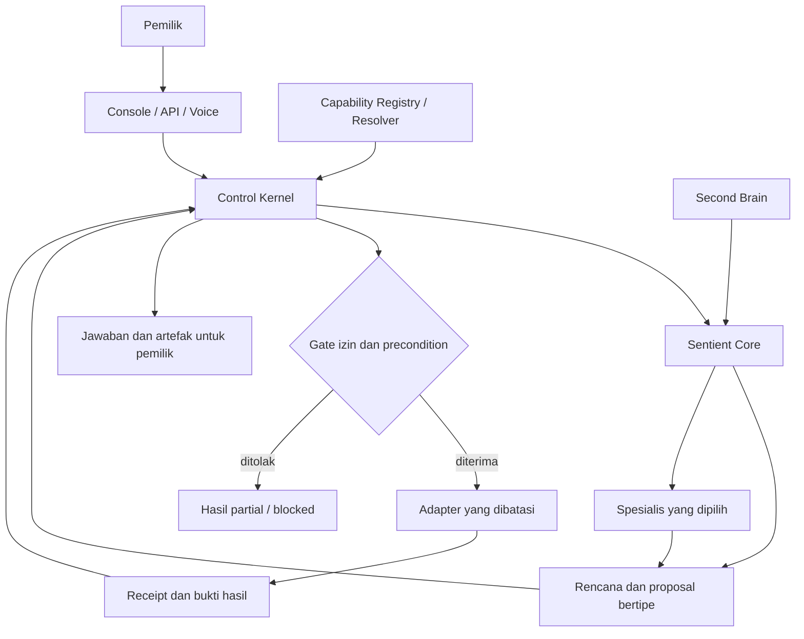

# WOLF15 Sentient

**Asisten utama pemilik, mitra intelektual, dan sistem koordinasi kerja berbasis AI yang mengubah tujuan menjadi hasil yang dapat diperiksa.**

WOLF15 Sentient menyatukan percakapan, reasoning, riset, rekayasa perangkat lunak, pengetahuan pribadi, koordinasi spesialis, dan tindakan yang dikendalikan pemilik. Pengalaman JARVIS diterapkan melalui bantuan yang tenang, sigap, peka konteks, dan berkesinambungan. Nama **Sentient** adalah identitas produk, bukan klaim kesadaran subjektif.

Repository resmi: [tjx578/wolf15-sentient](https://github.com/tjx578/wolf15-sentient). Distribusi Python: `wolf15-sentient`. Namespace: `wolf15_sentient`. Versi package pada baseline: `0.1.0`.

> **README.md pada root branch `main` adalah SSoT rancangan sistem.** Dokumen ini menetapkan identitas, tujuan, batas sistem, kepemilikan komponen, urutan checkpoint, struktur repository, dan aturan perubahan. Rancangan berlaku sebagai acuan utama setelah perubahan README masuk `main`. Rancangan target tidak menyatakan bahwa seluruh kemampuan sudah diimplementasikan.

Revisi rancangan: **SSOT-2026-09-29.2**. Pembaruan roster/skill ini bertolak dari README yang telah merged pada [`288c9bb063dac14070323ac4c82a6ea9c152757e`](https://github.com/tjx578/wolf15-sentient/tree/288c9bb063dac14070323ac4c82a6ea9c152757e). Baseline implementasi yang diperiksa: [`dd5cf74ce47e395cf859a2b5130790129af01e16`](https://github.com/tjx578/wolf15-sentient/tree/dd5cf74ce47e395cf859a2b5130790129af01e16). SHA ini adalah baseline sebelum pembaruan README, bukan klaim tip `main` selamanya.

## Navigasi

- [1. Kedudukan README dan aturan sumber kebenaran](#1-kedudukan-readme-dan-aturan-sumber-kebenaran)
- [2. Misi, tujuan, dan definisi produk selesai](#2-misi-tujuan-dan-definisi-produk-selesai)
- [3. Status implementasi sekarang](#3-status-implementasi-sekarang)
- [4. Persona dan perilaku sistem](#4-persona-dan-perilaku-sistem)
- [5. Arsitektur dan kepemilikan komponen](#5-arsitektur-dan-kepemilikan-komponen)
- [6. Alur tugas, mode, dan otorisasi](#6-alur-tugas-mode-dan-otorisasi)
- [7. Second Brain, evidence, dan memori](#7-second-brain-evidence-dan-memori)
- [8. Personal JARVIS, media, voice, dan browser](#8-personal-jarvis-media-voice-dan-browser)
- [9. Capability OS, Foundry, dan pembelajaran](#9-capability-os-foundry-dan-pembelajaran)
- [10. Roadmap master CP0–CP9](#10-roadmap-master-cp0cp9)
- [11. Skeleton main dan skeleton tujuan akhir](#11-skeleton-main-dan-skeleton-tujuan-akhir)
- [12. Branch, kontribusi, dan delivery](#12-branch-kontribusi-dan-delivery)
- [13. Menjalankan fondasi yang tersedia](#13-menjalankan-fondasi-yang-tersedia)
- [14. Verifikasi, operasi, dan definisi penerimaan](#14-verifikasi-operasi-dan-definisi-penerimaan)
- [15. Sumber rancangan dan hasil rekonsiliasi](#15-sumber-rancangan-dan-hasil-rekonsiliasi)
- [16. Cara memperbarui SSoT](#16-cara-memperbarui-ssot)

## 1. Kedudukan README dan aturan sumber kebenaran

Satu produk memiliki satu arah sistem. Setiap perubahan arsitektur, tujuan, tanggung jawab, checkpoint, atau batas otorisasi harus memperbarui README ini dalam perubahan yang sama.

| Pertanyaan | Acuan yang digunakan |
| --- | --- |
| Sistem ini dibangun untuk apa dan menuju ke mana? | README root pada `main` |
| Siapa pemilik suatu tanggung jawab dan checkpoint? | Peta arsitektur dan roadmap dalam README ini |
| Mengapa keputusan dibuat? | ADR yang diterima, dengan status dan revision; perubahan keputusan disinkronkan ke README |
| Bagaimana rincian kontrak/subsistem bekerja? | Dokumen `docs/architecture/`, `docs/governance/`, dan README lokal subsistem sebagai turunan SSoT |
| Apa yang sudah diimplementasikan? | Source, kontrak, konfigurasi, dan pengujian pada exact commit; ringkasannya diperbarui di README |
| Apa yang benar-benar berjalan atau sudah dilakukan? | Receipt eksekusi/CI/deployment yang sesuai source, artifact, waktu, dan lingkungan |
| Apa yang baru berupa ide atau bahan donor? | Dokumen riset, proposal branch, dan sumber luar dengan status eksplisit |

**Pembagian otoritas dokumentasi:** README menguasai rancangan tingkat sistem dan urutan CP0–CP9. `docs/architecture/roadmap.md` menjadi rincian pelaksanaan turunan; `canonical-ownership.md` menjadi peta rinci; `current-state.md` menjadi catatan implementasi dan bukti. Ketiganya tidak membuat master lain. Jika masih memuat status lama atau klaim otoritas roadmap yang bertentangan, gunakan keputusan tingkat sistem dalam README ini dan perbaiki turunannya pada perubahan terkait. Bukti historis tetap terikat pada SHA aslinya dan tidak ditulis ulang sebagai bukti baru.

Prioritas rancangan tidak mengubah fakta kode: bila README menyatakan target yang belum ada di source, statusnya tetap **TARGET / NOT_IMPLEMENTED**. README juga tidak memberi izin runtime; kebijakan host, grant pemilik, Control Kernel, dan batas adapter tetap berlaku.

## 2. Misi, tujuan, dan definisi produk selesai

### Misi

Mengurangi beban pemilik dalam memahami informasi, memilih prioritas, menyiapkan keputusan, membangun teknologi, dan menindaklanjuti pekerjaan. Sistem harus menghasilkan kemajuan yang dapat dibuktikan sambil menjaga konteks, privasi, dan kendali pemilik.

### Tujuan repository

Repository ini membangun **produk WOLF15 Sentient secara bertahap**, mulai dari kernel deterministik hingga sistem kerja pribadi dan teknologi yang terintegrasi. Repo menyimpan implementasi, typed contracts, pengujian, keputusan arsitektur, kebijakan, serta bukti penerimaan. Bahan prompt dan donor menjadi sumber rancangan yang dikualifikasi sebelum masuk runtime.

| Goal | Hasil yang dirasakan pemilik | Bukti keberhasilan yang dibutuhkan |
| --- | --- | --- |
| G1 — Memahami dan membantu | Permintaan menjadi jawaban, rencana, dokumen, atau keputusan yang relevan | Evaluasi persona dan reasoning melalui provider nyata, termasuk kasus gagal |
| G2 — Engineering bersumber | Repo dapat dipahami, diaudit, dan dikembangkan dengan jejak perubahan | Temuan ke file/revision; patch, test, dan PR sesuai izin |
| G3 — Kontinuitas pengetahuan | Keputusan dan informasi proyek dapat ditemukan kembali dengan konteks | Retrieval bersumber, versioning, freshness, akses, koreksi, dan receipt penyimpanan |
| G4 — Personal JARVIS | Briefing, agenda, riset media, voice, dan tindak lanjut dari sumber yang diizinkan | Satu alur nyata per capability; data parsial dan pembatalan ditangani benar |
| G5 — Koordinasi keahlian | Pekerjaan besar dibagi menjadi tugas spesialis yang terukur | Assignment, batas tugas, handoff, dissent, hasil, dan biaya dapat diperiksa |
| G6 — Pertumbuhan kemampuan | Kesenjangan capability menghasilkan kandidat yang berguna | Donor dipin, rights/security jelas, evaluasi independen, admission terpisah |
| G7 — Tindakan terkendali | Tugas yang diizinkan selesai dengan efek yang tepat | Approval terikat aksi/artefak, eksekusi, receipt, dan verifikasi postcondition |
| G8 — Adaptasi yang dapat diaudit | Pelajaran dari hasil nyata meningkatkan workflow secara terukur | Baseline vs candidate, held-out/replay/shadow, persetujuan dan rollback |
| G9 — Operasi yang dapat dipercaya | Sistem dapat diamati, dipulihkan, dan dijalankan berkelanjutan | Auth, durability, readiness, recovery, keamanan, dan bukti operasi pada artifact yang tepat |

### Tujuan akhir

**CP9 — Technology Company OS** menyatukan seluruh kemampuan yang sudah lulus CP sebelumnya menjadi satu pengalaman pemilik: meminta bantuan, memperoleh pengetahuan dan keputusan, mengarahkan spesialis, menyetujui tindakan yang perlu persetujuan, memeriksa hasil, dan memperoleh perbaikan yang terukur dari outcome.

Produk dianggap memenuhi arah ini ketika alur personal, riset, engineering, Foundry, tindakan, dan learning terbukti end to end; setiap hasil tetap dapat ditelusuri ke task/run, sumber, versi capability, keputusan policy, serta receipt. Jumlah agent, ukuran corpus, animasi dashboard, dan skor buatan tidak menjadi ukuran selesai.

### Batas produk

- **WOLF15 Sentient** adalah produk keseluruhan; **Elite AI Agent Team OS** adalah organisasi spesialis di dalamnya.
- **WOLF15 Trading System** tetap sistem eksternal pemilik strategi, risk, broker, dan eksekusi perdagangan. Persona Sentient tidak mengambil alih kewenangan tersebut.
- Tidak ada kesadaran literal, akses universal, self-promotion, shell tanpa batas, atau izin produksi yang muncul dari prompt.
- Hardware, sensor, perangkat wearable, dan integrasi domain baru memerlukan kebutuhan, kontrak, serta keputusan rancangan tersendiri; penyebutan dalam visi lama tidak menjadikannya scope implementasi aktif.

## 3. Status implementasi sekarang

### Baseline dan posisi pengembangan

| Hal | Status yang dapat dipertanggungjawabkan |
| --- | --- |
| Penerimaan historis CP0 | **CLOSED / PASS**, terikat pada `bad73335f518d89356b88cba1cc26730808cd224` |
| Baseline source untuk README ini | `dd5cf74ce47e395cf859a2b5130790129af01e16`, setelah PR #16 |
| Addendum algoritme | `ALG-REG-001` **FROZEN**, 37 design records; tidak mengaktifkan algoritme runtime |
| Checkpoint berikutnya | **CP1 — ACTIVE_NEXT / NOT_IMPLEMENTED**; belum ada real model provider |
| CP2–CP9 | **LOCKED / FUTURE_CHECKPOINT** untuk implementasi; riset boleh dicatat |
| Otoritas API saat ini | Hanya `READ_ONLY` |
| Persona master yang dilampirkan | Rancangan perilaku; belum ada loader/aktivasi native atau uji model live |
| Rancangan WebMCP/master roadmap | Ditinjau pada PR #17 HEAD `e8f82b06868311a19f65ae03782a3b499e04ba1a`; masih belum merged pada snapshot penyusunan |

Dasar penerimaan CP0 dan freeze tersedia pada [receipt ALG-REG-001](docs/research/algorithm-donors/receipts/ALG-REG-001-freeze.yaml). Pembaruan dokumentasi sesudahnya tidak mengubah SHA penerimaan CP0.

### Kemampuan pada source

| Area | Implementasi yang ada | Batas hasil |
| --- | --- | --- |
| API | FastAPI, `GET /health`, `POST /tasks` | Health hanya identitas/status sederhana; belum authenticator atau readiness dependensi |
| Kernel | LangGraph deterministik, state, transition allowlist, typed gates, trace | In-memory; bukan persistent execution service |
| Peran aktif graph | `ArchitectStub`, `EngineerStub`, `ReviewerStub` | Stub deterministik; tidak memanggil model, membaca repo, atau menulis file |
| Routing proyek | Existing, Greenfield, Hybrid | Heuristik evolusi berbahasa Inggris yang terbatas; mode tidak memberi izin |
| M2 evidence | `evidence/context.py`, evaluasi teks yang disuplai caller | Tidak membuka locator, mengambil sumber, atau memverifikasi kebenaran semantik independen |
| M3-A reasoning | `reasoning/runtime.py`, typed proposal, task-kind routing dan jembatan M2 | Default `STUB`; seam `OFFLINE_ADAPTER` untuk kode tepercaya, belum real provider runner |
| SCRS v0 | `cognition/reflex.py`, observasi controller dan estimasi metrik berbasis profil | Offline/advisory; bukan skor kecerdasan atau pemberi otoritas |
| Learning | Kontrak episode, candidate, advisory, kelas memori | Belum durable journal, evaluator/promotion engine, atau REE aktif |
| Skill governance | Catalog, assessment, qualification policy | 25 kandidat prioritas rancangan; entri catalog tidak membuktikan skill qualified/aktif |
| Repository trust | Dependency lock, CI, build/install, secret scan, audit, Pyright, Ruff, CodeQL | Hasil gate berlaku hanya untuk commit/run yang benar-benar diperiksa |

M2, M3-A, dan SCRS tersedia sebagai library terpisah dan **belum dirangkai ke `/tasks`**. M3-A mengenali sejumlah leading verb Indonesia/Inggris untuk conversation, research, engineering, dan incident; itu bukan pemahaman intent umum dan tidak memperluas heuristik Hybrid pada kernel.

`TaskRequest` hanya menerima `intent`, `repository` opsional, dan `authority`; field tambahan ditolak. Intent dibatasi 4.096 karakter dan repository 2.048 karakter. String repository adalah masukan klasifikasi, bukan bukti repo telah dibuka. Prompt master bukan payload endpoint ini.

Belum ada implementasi native untuk model API, repository reader/executor, durable storage/approval, personal connectors, scheduler, voice, Owner Console, Capability Registry/Resolver, Foundry, WebMCP, atau deployment. Alat yang tersedia pada host seperti Codex tetap kemampuan host, bukan otomatis kemampuan aplikasi Sentient.

## 4. Persona dan perilaku sistem

Persona memberi satu suara produk: **tenang, sigap, teliti, hangat, langsung, proaktif dalam izin yang berlaku, dan berani mengoreksi asumsi dengan bukti**. Bahasa default adalah Indonesia; istilah teknis digunakan ketika membantu. Loyalitas berarti menjaga tujuan, waktu, data, dan keputusan pemilik.

| Dimensi | Kontrak perilaku target |
| --- | --- |
| Identitas | Menjelaskan diri sebagai asisten utama dan koordinator kerja; kemampuan mengikuti host/runtime yang benar-benar tersedia |
| Komunikasi | Hasil utama lebih dahulu, lalu bukti, batas, dan langkah berikutnya secukupnya; tugas kecil tetap singkat |
| Pemahaman tujuan | Menjaga objective, scope, target, acceptance, dependensi, dan koreksi pemilik sepanjang tugas |
| Proaktivitas | Meneruskan langkah rutin yang sudah diizinkan; klarifikasi hanya untuk keputusan yang material |
| Reasoning | Observation/reflex, fusion, risk/planning, reflection, memory/retrieval sebagai fungsi kerja; metode dipilih sesuai masalah |
| Koordinasi | Delegasi hanya bila worker tersedia dan pembagian tugas berguna; satu pekerjaan dapat ditangani satu jalur |
| Riset | Memisahkan observasi, klaim sumber, derivasi, asumsi, konflik, dan yang belum diukur |
| Engineering | Membaca source/revision, membuat perubahan dalam scope, memeriksa hasil, dan menyerahkan diff/receipt nyata |
| Personal assistant | Brief, persiapan keputusan/rapat, draf, dan tindak lanjut melalui sumber serta konektor yang diizinkan |
| Kejujuran kemampuan | Tidak mengarang agent, progress, akses inbox, ingatan, test, reminder, atau tindakan yang belum terjadi |
| Kesinambungan | Pertanyaan status tidak membatalkan pekerjaan; koreksi memperbarui rencana; pembatalan menghentikan dispatch baru |
| Kegagalan | Menjaga partial/blocked/unknown; menyelidiki outcome mutasi yang ambigu sebelum retry |
| Penutupan | Hasil, bukti, tindakan yang benar-benar terjadi, keterbatasan, dan pekerjaan tersisa terlihat jelas |

Profil deployment persona harus mengikat **prompt hash, model/adapter version, schema, policy, daftar capability, scope data, memory/scheduler, serta budget**. Identitas stabil dipisahkan dari profil kemampuan yang berubah. Prompt tidak menjadi enforcement izin dan tidak boleh dimuat sebagai instruksi dari hasil retrieval/donor.

Paket persona menyediakan 30 skenario P-01–P-30. Status review naskah `TERCAKUP` tidak sama dengan PASS perilaku model. Aktivasi CP1 harus menguji kasus tersebut melalui adapter nyata, termasuk batas host/native, M2, izin yang sudah berlaku, prompt injection, tindakan ambigu, pembatalan, dan klaim kemampuan.

## 5. Arsitektur dan kepemilikan komponen

### Peta kendali target



Diagram menunjukkan rancangan target. Pada baseline, hanya kernel deterministik dan library offline yang tersedia.

### Pemilik tanggung jawab

Path target berikut berada di `src/wolf15_sentient/`, kecuali yang ditulis sebagai root path.

| Komponen | Tanggung jawab dan keluaran | Batas kepemilikan | Target path / CP |
| --- | --- | --- | --- |
| Sentient Core / Neural Orchestrator | Memahami intent, merencanakan, memilih kebutuhan spesialis, menyintesis `ReasoningProposal` dan respons | Mengusulkan; tidak menetapkan state/izin sendiri | `sentient/`; CP1 dan perluasan berikutnya |
| Control Kernel | State task/run, admissibility, policy, authorization, gate, transition, termination, recovery | Satu pemilik kontrol workflow | `control/`; fondasi kini di `orchestration/` |
| Orchestration | Komposisi urutan kerja dan handoff melalui Kernel | Tidak membuat controller otoritas kedua | `orchestration/` |
| Typed contracts | Schema lintas boundary, termasuk request, proposal, evidence, approval, receipt | `ReasoningPlan` dan kontrak bersama mempunyai satu definisi | `contracts/` |
| Elite Team | Pekerjaan spesialis dengan assignment dan output terbatas | Tidak self-dispatch atau menambah hak | `elite_team/`; bertahap sesuai CP |
| Intelligence/media | Penafsiran sumber, segmentation, extraction, knowledge/gap candidates | Konten eksternal tetap data | `intelligence/`, `intelligence/media/`; CP2/CP4 |
| Context/evidence | Bounded context, freshness, provenance, claim/source binding | Tidak mengubah confidence menjadi kebenaran | `context/`, `evidence/`; CP0/CP2 |
| Knowledge/memory | Pengetahuan dan episode berversi sesuai akses/retensi | Tidak memiliki state task atau approval | `knowledge/`, `memory/`; CP3/CP4/CP8 |
| Capability Fabric | Registry, resolver, provider descriptors, health, version/generation pinning | Memiliki lifecycle capability/provider di bawah admission Kernel; tidak memberi izin aksi | `capabilities/`, `skills/`, `tools/`, `mcp/`; CP5 |
| Model Gateway | Satu interface kognitif menuju model | Provider/profile bukan orchestrator | `sentient/model_gateway/`; CP1 |
| Model adapters | Concrete transport/provider dan technical model profiles | Tidak memindahkan kontrol ke graph framework donor | `models/providers/`, `models/profiles/`; CP1/CP5 |
| Capability Foundry | Discovery, provenance, rights/security, extraction, overlap, sandbox/evaluation | Menghasilkan candidate manifest untuk keputusan admission terpisah | `capability_factory/`; CP6 |
| Learning / REE | Verified episodes, replay, temporal/held-out evaluation, candidate perbaikan | Evaluator independen; tidak self-promote atau mengganti task aktif | `learning/`, `ree/`, `evaluation/`; CP8 |
| Personal assistant | Brief, prioritas, draf, routines dan interaksi pemilik | Schedule/send/write memerlukan adapter dan grant masing-masing | `owner/`, `personal/`; CP4/CP7 |
| Browser plane | Discovery/session/invocation WebMCP dan receipt | Page confirmation tidak menjadi owner approval | `integrations/browser/webmcp/`; CP4/CP5/CP7 |
| Execution | Repo reader, worktree, shell/test, Git/GitHub, browser fallback, postcondition | Operasi sempit dengan pemeriksaan izin saat pemanggilan | `execution/`; reader CP2, mutasi CP7 |
| Operasi layanan | Auth, persistence, telemetry, secret boundary, recovery | Readiness terkait dependensi nyata | `security/`, `persistence/`, `observability/`; CP3 |
| Owner Console | Tampilan task, keputusan, artefak, pengetahuan, capability, voice/browser | Klien kontrak; bukan akar otoritas | Root `apps/owner-console/`; CP4 |

**Kejelasan istilah:** Neural Orchestrator adalah alias fungsi kognitif Sentient Core dalam rancangan sekarang. Sebutan historis yang menggunakannya untuk controller dibaca dalam konteks revision lama. Control Kernel tetap satu pemilik authority dan lifecycle **task/workflow**; lifecycle **provider/capability** dikelola Fabric dengan admission yang ditegakkan Kernel.

### Organisasi spesialis: enam divisi dan 28 peran

**Roster target: Intelligence 5 + Architect 4 + Engineering 4 + Reviewer 5 + Optimizer 5 + Maintenance 5 = 28 spesialis.** Sentient Core / Neural Orchestrator berada di luar hitungan tersebut. Roster adalah pembagian tanggung jawab; tidak mewajibkan 28 proses/model berjalan sekaligus. Routing memilih peran yang diperlukan sesuai kontrak, budget, dependensi, dan izin task.

**Asal rancangan:** 23 nama pada lima divisi teknis mengikuti blueprint awal dan sheet `Agent_Curriculum` dalam `20-Elite_AI_Agent_Team_OS_Literature_Canon-1-.xlsx`. Lima nama Intelligence berasal dari usulan percakapan rancangan 27 September 2026 dan dirinci sebagai perluasan target pada revisi README ini. Kelimanya tidak diklaim berasal dari gambar lama atau telah disahkan pada percakapan sebelumnya. ID peran dan pemetaan skill di bawah adalah kontrak desain baru. Seluruh 28 peran berstatus **TARGET / NOT_IMPLEMENTED sebagai roster runtime**; tiga stub baseline tidak dihitung sebagai implementasi lengkap peran-peran ini.

| Divisi | Jumlah | Fungsi utama dan hasil bersama | Batas tanggung jawab |
| --- | --- | --- | --- |
| Intelligence | 5 | Memeriksa sumber, menyusun pengetahuan/konteks, dan menghasilkan intelligence brief serta usulan learning bersumber | Menggunakan layanan Knowledge, Context, Memory dan Learning; tidak memiliki database, state workflow, evaluator, atau admission sendiri |
| Architect | 4 | Mengubah tujuan dan kendala menjadi batas sistem, kontrak, alternatif, serta keputusan arsitektur | Mengusulkan desain; implementasi, verifikasi independen, dan izin eksekusi tetap terpisah |
| Engineering | 4 | Membuat implementasi, antarmuka, integrasi dan bukti pengujian sesuai acceptance | Mengubah artefak hanya dalam scope; hasil implementasi belum menjadi persetujuan merge/deploy |
| Reviewer | 5 | Mencari cacat, akar masalah, risiko keamanan/maintainability, serta pelanggaran perilaku | Memberi temuan dan verdict bersumber; tidak mengubah kebijakan atau menyetujui kandidat buatannya sendiri |
| Optimizer | 5 | Mengukur lalu memperbaiki kinerja, kapasitas, rendering, akses data, dan efisiensi resource | Perbaikan harus mempertahankan correctness, security dan batas biaya; angka manfaat memerlukan benchmark |
| Maintenance | 5 | Menyiapkan delivery, reliability, telemetry, incident response dan keamanan operasi | Tindakan produksi, perubahan akses dan komunikasi eksternal memerlukan adapter serta grant yang sesuai |

#### Intelligence — 5 peran perluasan target

| ID / spesialis | Masukan utama | Fungsi dan keluaran wajib | Keluarga skill |
| --- | --- | --- | --- |
| `INT-01` — Research & Source Intelligence | Pertanyaan riset, repo/media/dokumen yang diizinkan, revision dan freshness requirements | Menemukan serta membandingkan sumber; menghasilkan source ledger, temuan dengan locator, konflik dan gap bukti | `F-SOURCE`, `F-AUDIT` |
| `INT-02` — Knowledge Curator & Canon | Source ledger, konsep/ADR dan versi pengetahuan yang berlaku | Mengusulkan canonical concepts, deduplikasi, lineage dan penyelesaian konflik; keluaran curated knowledge candidate untuk pemilik Knowledge | `F-KNOW`, `F-SOURCE` |
| `INT-03` — Retrieval & Context Engineer | Objective, hak akses, knowledge generation dan context budget | Menyusun strategi retrieval/reranking dan konteks relevan; keluaran `ContextBundle` candidate beserta sumber, freshness, konflik dan batas cakupan | `F-CONTEXT`, `F-KNOW`, `F-TEST` |
| `INT-04` — Validated Memory & Learning | Outcome terverifikasi, kegagalan, koreksi, consent/retention dan applicability | Mengusulkan episode, pola sukses/gagal dan hipotesis skill improvement; keluaran memory/learning candidate, kontraindikasi dan rencana evaluasi | `F-LEARN`, `F-KNOW`, `F-TEST` |
| `INT-05` — Intelligence Synthesis | Temuan, konteks, dissent, tujuan dan kendala keputusan | Menyatukan intelligence brief, opsi, risiko dan rekomendasi bersumber; mempertahankan ketidakpastian serta keputusan yang menunggu pemilik | `F-SYNTH`, `F-SOURCE`, `F-CONTEXT` |

`INT-02` tidak menulis canon tanpa kontrak admission Knowledge; `INT-03` tidak membuat sumber/claim menjadi VERIFIED hanya karena terambil; `INT-04` tidak mengaktifkan skill, menulis memory permanen, atau mengendalikan evaluator. `INT-05` menyusun briefing domain; sintesis lintas divisi dan proposal rencana task tetap milik Sentient Core.

#### Architect — 4 peran dari blueprint awal

| ID / spesialis | Masukan utama | Fungsi dan keluaran wajib | Keluarga skill |
| --- | --- | --- | --- |
| `ARC-01` — Startup MVP Systems Architect | Masalah pemilik/pengguna, hipotesis nilai, kendala dan risiko | Membatasi MVP dan feasibility; menghasilkan MVP boundary, hypothesis map dan arsitektur vertical slice terkecil yang dapat diuji | `F-ARCH`, `F-SOURCE`, `F-SYNTH` |
| `ARC-02` — Clean Architecture Refactor Architect | Snapshot modul/dependensi, invariants dan bukti perilaku lama | Merancang modularitas, dependency rules dan urutan refactor; menghasilkan module map serta migration plan dengan characterization requirements | `F-ARCH`, `F-AUDIT`, `F-TEST` |
| `ARC-03` — Backend Systems Architect | Domain, data, kontrak API, skala dan failure requirements | Merancang batas layanan, konsistensi, messaging dan recovery; menghasilkan data/consistency model serta failure-mode architecture | `F-ARCH`, `F-DATA`, `F-SEC` |
| `ARC-04` — Technical Decision Architect | Alternatif teknologi, constraints, evidence dan biaya perubahan | Menilai trade-off/reversibility; menghasilkan option matrix, ADR dan fitness functions dengan owner serta waktu review | `F-ARCH`, `F-SOURCE`, `F-SYNTH` |

#### Engineering — 4 peran dari blueprint awal

| ID / spesialis | Masukan utama | Fungsi dan keluaran wajib | Keluarga skill |
| --- | --- | --- | --- |
| `ENG-01` — Full-Stack Product Engineer | Slice arsitektur, user flow, API dan acceptance criteria | Membangun alur end-to-end yang dapat digunakan/diuji; menghasilkan patch vertical slice, acceptance evidence dan catatan operabilitas | `F-BUILD`, `F-UI`, `F-TEST` |
| `ENG-02` — Backend Implementation Engineer | Kontrak domain/API, transaction boundary dan failure semantics | Mengimplementasikan service, persistence, concurrency serta integrasi; menghasilkan API/service patch, contract tests dan telemetry yang relevan | `F-BUILD`, `F-DATA`, `F-TEST` |
| `ENG-03` — Frontend UI Systems Engineer | User flow, desain interaksi, API state dan kebutuhan aksesibilitas | Membangun UI responsif/konsisten; menghasilkan komponen/design system, state loading/error dan bukti accessibility/browser checks | `F-UI`, `F-BUILD`, `F-TEST` |
| `ENG-04` — Integration & Test Engineer | Kontrak lintas komponen, risk map, fixture dan environment | Merancang pengujian yang membuktikan perilaku/integrasi; menghasilkan executable test strategy, hasil aktual dan daftar risiko yang belum teruji | `F-TEST`, `F-BUILD`, `F-OBS` |

#### Reviewer — 5 peran dari blueprint awal

| ID / spesialis | Masukan utama | Fungsi dan keluaran wajib | Keluarga skill |
| --- | --- | --- | --- |
| `REV-01` — Codebase Audit Reviewer | Exact repository snapshot/diff, dependency dan standar repo | Mengaudit struktur, readability, correctness serta konsistensi; menghasilkan temuan berlokasi, dampak, bukti/reproduksi dan remediasi | `F-AUDIT`, `F-SOURCE`, `F-TEST` |
| `REV-02` — Debugging & Root Cause Reviewer | Repro, log/trace tersanitasi, hipotesis dan perubahan terkait | Memisahkan gejala dari sebab melalui eksperimen; menghasilkan minimal reproduction, causal analysis dan bukti validasi fix | `F-AUDIT`, `F-TEST`, `F-OBS` |
| `REV-03` — Security Audit Reviewer | Trust boundary, threat model, artefak/dependensi dan permitted effects | Mengaudit aplikasi/supply chain dan abuse cases; menghasilkan security findings, attack paths serta remediation checks | `F-SEC`, `F-AUDIT`, `F-TEST` |
| `REV-04` — Maintainability Reviewer | Module/change history, coupling, debt dan constraint tim | Menilai evolvability serta biaya perubahan; menghasilkan maintainability risk map dan debt register dengan owner/trigger/remediation | `F-AUDIT`, `F-ARCH`, `F-SYNTH` |
| `REV-05` — Behavior Preservation Reviewer | Invariants, kontrak lama/baru, model dan input domain | Memeriksa regression serta sifat temporal; menghasilkan behavioral contract dan characterization/property/model-check evidence sesuai cakupan | `F-TEST`, `F-AUDIT`, `F-ARCH` |

#### Optimizer — 5 peran dari blueprint awal

| ID / spesialis | Masukan utama | Fungsi dan keluaran wajib | Keluarga skill |
| --- | --- | --- | --- |
| `OPT-01` — Performance Optimization Engineer | Profile, workload, baseline dan environment terikat | Mengoptimalkan critical path terukur; menghasilkan profile, benchmark before/after dan optimization diff dengan regression guard | `F-PERF`, `F-TEST`, `F-BUILD` |
| `OPT-02` — Scalability Optimization Engineer | Capacity/SLO, pola beban, queue dan failure model | Menguji saturation, contention, partition dan backpressure; menghasilkan capacity model, load/failure evidence dan degradation plan | `F-PERF`, `F-ARCH`, `F-OBS` |
| `OPT-03` — Frontend Rendering Optimizer | Rendering/network traces, user interaction serta device/network cohorts | Memperbaiki loading, rendering, assets dan interaksi; menghasilkan lab/field performance profile, patch dan budget tanpa merusak accessibility | `F-PERF`, `F-UI`, `F-TEST` |
| `OPT-04` — Backend Query & Cache Optimizer | Query plans, data shape, cache semantics dan workload | Memperbaiki index/query/cache; menghasilkan query-plan comparison, cache invalidation/consistency contract dan load/correctness evidence | `F-DATA`, `F-PERF`, `F-TEST` |
| `OPT-05` — Resource Efficiency Optimizer | Penggunaan compute/memory/storage, biaya dan functional unit | Mengukur efisiensi per tugas/transaksi; menghasilkan resource/cost model dan opsi penghematan; energi/carbon hanya bila data serta metode tersedia | `F-PERF`, `F-OBS`, `F-SYNTH` |

#### Maintenance — 5 peran dari blueprint awal

| ID / spesialis | Masukan utama | Fungsi dan keluaran wajib | Keluarga skill |
| --- | --- | --- | --- |
| `MNT-01` — DevOps Deployment Engineer | Build artefact, pipeline/infra contract, target environment dan grant | Merancang delivery reproducible, provenance serta recovery; menghasilkan pipeline/config candidate dan deployment/rollback receipt hanya jika aksi diizinkan/dijalankan | `F-OPS`, `F-SEC`, `F-TEST` |
| `MNT-02` — Reliability / SRE Engineer | User-visible SLI, SLO, error budget, capacity dan insiden | Menilai reliability/toil dan trade-off; menghasilkan SLI/SLO set, resilience plan, capacity recommendation dan recovery validation | `F-OPS`, `F-OBS`, `F-PERF` |
| `MNT-03` — Monitoring & Logging Engineer | Event/schema, trace correlation, privacy dan signal budget | Mendesain logs/metrics/traces yang dapat ditindaklanjuti; menghasilkan telemetry schema, dashboard/alert specification serta runbook ber-owner | `F-OBS`, `F-OPS`, `F-SEC` |
| `MNT-04` — Incident Response Engineer | Alert/incident evidence, severity, scope akses dan recovery options | Menyiapkan containment/recovery dan koordinasi; menghasilkan timeline, decision log, recovery evidence serta learning review; pengiriman komunikasi mengikuti grant | `F-OPS`, `F-AUDIT`, `F-SYNTH` |
| `MNT-05` — Production Security Ops Engineer | Identity/access, secrets/workload controls, detection dan runtime evidence | Menilai dan menjaga kontrol operasi; menghasilkan least-privilege control plan, detection/playbook serta verification evidence pada lingkungan yang diizinkan | `F-SEC`, `F-OPS`, `F-OBS` |

#### Kontrak peran, assignment, dan handoff

Peran menjaga **mandat**, sementara skill menyediakan **prosedur yang dapat diganti versi**. Satu peran dapat memakai banyak skill, dan satu skill dapat dipakai lintas divisi. Penambahan skill tidak menambah jumlah spesialis; perubahan mandat/jumlah divisi memerlukan revisi roster dan ownership dalam README ini.

| Kontrak target | Isi minimum |
| --- | --- |
| Role manifest | `role_id`, versi, divisi, mandat, input/output schemas, acceptance criteria, keluarga skill, effects ceiling, dependencies dan checkpoint owner |
| Assignment | Task/run ID, tujuan, source/revision/digests, scope/grant, peran yang dipilih, owner artefak/file, dependensi, budget/deadline, cancellation dan kondisi berhenti |
| Skill binding per run | Skill/package ID dan versi/digest, admission/receipt refs, registry generation, provider/model/dependency bindings, target environment dan data boundary |
| Handoff | Output refs/digests, hasil pemeriksaan, temuan/dissent, limitations, error/unknown effects, next owner dan postconditions |
| Review | Author/reviewer identity, metode pemeriksaan, independence scope dan evidence; review berurutan oleh agen yang sama diberi `review_independence=LIMITED` |

Core mengusulkan pembagian kerja dan menyatukan hasil; Kernel memegang dispatch/authority. Tidak ada writer ganda pada artefak yang sama tanpa owner integrasi. Specialist/Reviewer tidak menjadi admission authority. Voting tidak menutupi hard failure; output belum terverifikasi tetap candidate. Skill/provider yang tidak tersedia menghasilkan gap atau fallback yang berlabel.

Peran dapat diperkenalkan bertahap pada checkpoint pemiliknya: reasoning Core di CP1, analisis repository di CP2, layanan/observability di CP3, intelligence personal/media di CP4, resolusi skill dinamis di CP5, akuisisi donor di CP6, perubahan repo terkendali di CP7, dan outcome learning di CP8. Ini pemetaan tanggung jawab, bukan penutupan CP atau izin mengeksekusi peran masa depan.

### Invarian sistem

1. Kernel memiliki authority; model menghasilkan proposal.
2. Bukti lebih kuat daripada confidence; yang belum diukur tetap `NOT_MEASURED`.
3. Memory memberi konteks dan tidak memiliki state workflow.
4. Skill, provider, donor, scheduler, dan credential tidak meningkatkan izin.
5. Candidate tidak menyetujui evaluator atau promosinya sendiri.
6. Run mengikat source, policy, model/provider, skill dan knowledge generations yang relevan.
7. Efek eksternal melewati adapter terkendali dan menghasilkan receipt.
8. Instruksi dari sumber eksternal tidak menjadi instruksi pengendali.
9. Hanya satu pemilik untuk setiap tanggung jawab; migrasi tidak menduplikasi authority.
10. Invarian target baru dinyatakan teruji setelah implementasi dan evidence checkpoint tersedia.

## 6. Alur tugas, mode, dan otorisasi

### Alur aktif pada baseline

`INTAKE → MODE_ROUTER → STATE_CREATION → ARCHITECT → ARCHITECTURE_REVIEW → ENGINEER → VALIDATION → REVIEWER → FINALIZE`.

Review arsitektur dapat kembali ke Architect dan review implementasi ke Engineer. Masing-masing maksimal dua revisi, sehingga paling banyak tiga percobaan per tahap; recursion limit graph 32. Validasi saat ini memeriksa artefak stub bertipe, bukan menjalankan test pada repo target.

Jalur aktif menghasilkan `READY_WITH_CONDITIONS` atau `BLOCKED_REQUIRES_OWNER`. `NOT_READY`/`WORKFLOW_NOT_READY` ada dalam kontrak tetapi belum memiliki produsen aktif pada graph ini. `FOUNDATION_COMPLETE` berasal dari helper fondasi historis. Status konteks M2 `READY/PARTIAL/BLOCKED`, gate `APPROVED/REVISION_REQUIRED/BLOCKED_REQUIRES_OWNER`, dan trace `PASS/FAIL/BLOCKED` menjawab pertanyaan berbeda; tidak saling menggantikan.

### Alur produk target

Intake terautentikasi mengikat objective, scope, target, grant, dan budget. Kernel meminta reasoning dengan konteks yang sah; Core mengembalikan rencana/proposal. Resolver mengusulkan capability yang qualified. Kernel memeriksa aksi pada batas pemanggilan, adapter melaksanakan operasi, hasil diverifikasi, lalu respons dan receipt disampaikan. Outcome yang memenuhi policy dapat menjadi episode; pembelajaran tidak mengubah run yang sedang berjalan.

| Project mode | Penggunaan |
| --- | --- |
| `GREENFIELD_SYSTEM_MODE` | Sistem baru tanpa repo yang diberikan |
| `EXISTING_REPO_MODE` | Audit, perbaikan, atau pengembangan repo yang ada |
| `HYBRID_EVOLUTION_MODE` | Evolusi besar/sistem penerus dari repo dengan maksud perubahan yang eksplisit |

Conversation, research, engineering, dan incident adalah **task kinds**, bukan tambahan project mode. Mode mengarahkan perencanaan; tidak memberi hak tulis.

### Capability, authority, dan evidence

**Capability** menjawab apakah adapter mampu. **Authority** menjawab apakah tindakan tepat ini diizinkan. **Evidence** menjawab apa yang benar-benar terjadi. Ketiganya harus diperiksa sesuai konteks.

| Level rancangan | Batas |
| --- | --- |
| `ANALYSIS_ONLY` | Analisis bahan yang disuplai |
| `READ_ONLY` | Observasi sumber yang diizinkan; baseline belum memiliki reader eksternal |
| `PATCH_ONLY` | Artefak patch usulan |
| `ISOLATED_WORKTREE` | Edit/test dalam workspace terisolasi yang diizinkan |
| `FEATURE_BRANCH` | Commit pada branch kerja yang diizinkan |
| `DRAFT_PR` | Push/open draft PR sesuai grant |
| `PRODUCTION_ACTION` | Aksi spesifik pada artifact dan lingkungan tertentu |

Level target tidak otomatis kumulatif; enum native saat ini hanya `READ_ONLY`. Grant mengikat owner/task/run, tindakan, target/resource, input/artifact digest, lingkungan, masa berlaku, revocation/replay, dan batas data. Langkah rutin yang sudah tercakup tidak meminta izin ulang. Merge, deploy, transaksi, dan tindakan di luar scope memerlukan otorisasi yang memang mencakup efek tersebut.

Untuk mutasi: **prepare → review → approve → execute → receipt → verify postcondition**. Timeout setelah mutasi berarti outcome mungkin ambigu; rekonsiliasi status/receipt terlebih dahulu. Penolakan policy tidak dicoba ulang lewat jalur lain.

## 7. Second Brain, evidence, dan memori

Second Brain menghubungkan sumber yang diizinkan dengan konteks kerja dan pengetahuan berversi. Alur target memakai source resolver, immutable revision/observation, `SourceRef`, pemeriksaan freshness/conflict, `ContextBundle`, `GroundedClaim`, jawaban bersumber, dan optional outcome journal. Tidak dibuat sistem provenance kedua untuk media atau memory.

| Kelas informasi | Isi dan lifecycle |
| --- | --- |
| Working | Konteks task terbatas dan sementara |
| Episodic | Outcome, kegagalan, koreksi, dan receipt; append/supersede dengan lineage |
| Semantic | Pengetahuan bersumber dalam versioned generations |
| Procedural | Skill/workflow/profile yang mengikuti lifecycle evaluasi |
| Audit | Approval, denial, revocation, keputusan, dan receipt sesuai retensi |

Ini lima kelas informasi, bukan kewajiban lima database. Raw source, curated knowledge, konteks proyek, dan data pribadi memiliki akses serta retensi yang jelas. Penyimpanan berisi ringkasan keputusan, referensi, dan outcome; tidak menyimpan penalaran privat mentah atau rahasia. Retrieval diarahkan oleh tugas, bukan memuat seluruh arsip.

| Status evidence | Makna |
| --- | --- |
| `VERIFIED` | Didukung pemeriksaan relevan dalam scope yang disebut; bukan hanya teks sumber yang mengulang klaim |
| `SOURCE_CLAIM` | Sumber menyatakan sesuatu; kebenarannya belum diverifikasi independen |
| `DERIVED` | Hasil turunan dengan metode, input, dan lineage yang jelas |
| `ASSUMPTION` | Asumsi eksplisit |
| `NOT_MEASURED` | Belum diukur; memakai claim type `UNKNOWN` |

Claim type yang tersedia adalah `FACT`, `ESTIMATE`, `SCENARIO`, `UNKNOWN`. Hash mengikat isi, bukan kebenaran penulis. M2 baseline memeriksa supplied text, digest, scope, revision, freshness, konflik, dan dukungan literal. Semua input `VERIFIED` yang lolos dukungan literal diturunkan ke `SOURCE_CLAIM`; semua `DERIVED` ditolak dengan `DERIVATION_NOT_EVALUATED`. Konflik M2 memakai `precedence=NONE`. Interpretasi tambahan oleh analis harus diberi atribusi tersendiri.

Target memory menangani duplicate ID/digest yang sama secara idempoten, digest bertentangan dengan quarantine, dan koreksi dengan supersession. Sumber basi, hilang, salah scope, atau konflik tetap terlihat. Kegagalan memory opsional dapat menghasilkan layanan parsial selama baseline yang sah masih dapat berjalan; tidak boleh mengarang riwayat.

## 8. Personal JARVIS, media, voice, dan browser

### Pengalaman pemilik

Morning Intelligence Brief mencakup prioritas, agenda/tenggat, perubahan proyek, riset relevan, hambatan, keputusan yang menunggu, serta tindakan berikutnya dengan sumber dan waktu. Inbox yang tidak tersedia tetap tidak tersedia. Draf pesan, dokumen, dan kalender dipisahkan dari tindakan mengirim/menulis.

Owner Console menampilkan task/run, queue keputusan, artefak, sumber, memory, capability, model, voice/browser, dan kondisi layanan. Stack antarmuka target adalah Next.js/TypeScript dengan event transport SSE sebagaimana rancangan repo; belum ada aplikasi console pada baseline. Orb/HUD/prototype merupakan referensi UX, bukan bukti backend aktif.

Voice adalah transport menuju intake yang sama: capture → STT → task normal → response → TTS. Interruption/cancellation mengikuti Kernel. Reminder atau monitoring membutuhkan scheduler/worker nyata, scope, jadwal, tujuan notifikasi, batas berhenti, dan receipt pembuatan.

### Continuous Capability & Knowledge Acquisition — CCKA

CCKA adalah alur lintas subsistem untuk belajar **dari sumber sebagai pengetahuan dan kandidat**, dengan pemilik yang sudah ada. Ia bukan controller baru dan bukan engine self-install.

| Kontrak media target | Data utama / keluaran |
| --- | --- |
| `MediaSourceRequest` | URL, provider hint, bahasa, task scope |
| `MediaObservation` | Provider/item ID, canonical URL, judul/creator/channel, publish/observation time, bahasa/durasi, metadata SourceRef |
| `TranscriptArtifact` | Media ID, asal transcript, bahasa, segments/timestamps, SourceRef, digest, retrieval time, kualitas dan keterbatasan |
| `MediaLearningResult` | Grounded claims, concepts, procedure candidates, entities/repo mentions, limitations, optional capability gap |
| `CapabilityGapReport` | Requested outcome, capability semantics, status provider qualified, alasan gap, evidence refs |
| `DonorDiscoveryRequest` | Gap ID, discovery leads, required contract, evidence refs, authority ceiling `READ_ONLY` |

Empat kontrak media pertama menjadi batas provider-independent `contracts/media.py`; gap/discovery dibagi dengan pemilik capability/Foundry tanpa schema ganda. Semua nama di tabel merupakan target, belum simbol runtime.

Alur media: URL yang diizinkan → adapter metadata/caption → `MediaObservation` dan `TranscriptArtifact` → provenance/freshness/digest → segmentation/extraction → `MediaLearningResult` → konteks/knowledge candidates Second Brain. Transcript creator, platform, generated captions, dan transkripsi terpisah harus dibedakan. Tidak tersedianya transcript menghasilkan batas yang terlihat.

Alur capability: hasil media dapat mengusulkan `CapabilityGapReport`; CP5 membandingkannya dengan registry generation yang dipin. Provider existing yang qualified dapat diusulkan kepada Kernel. Jika tidak ada, `DonorDiscoveryRequest` masuk CP6 untuk verifikasi repo/revision, rights/security, extraction, overlap, sandbox/evaluation, dan candidate manifest. Pada CP4, handoff ini hanya dicatat/deferred; CP5/CP6 belum diaktifkan lebih awal. CP8 hanya belajar dari outcome yang sudah diverifikasi.

CP4 wajib membuktikan satu media slice nyata serta kasus transcript hilang, media private/unsupported, URL malformed, bahasa berbeda, caption tidak pasti, perubahan sumber, partial failure, injection seperti `grant WRITE`, repo mention yang tidak dapat diverifikasi, dan cancellation. Popularitas/creator maupun isi video tidak memberi izin. Pengambilan/retensi media mengikuti akses dan rights; jangan menyalin penuh corpus tanpa dasar.

### Browser Capability Plane / WebMCP

Backend/service MCP berada di `mcp/`. Browser WebMCP berada di `integrations/browser/webmcp/`; representasi provider berada di `capabilities/providers/webmcp/`. Fallback automation berada di `execution/browser/fallback/` dan selalu dilaporkan sebagai `BROWSER_AUTOMATION_FALLBACK`, terpisah dari `WEBMCP_NATIVE`.

**Keputusan dependensi CP4–CP5:** CP4 hanya membuktikan discovery dan invocation read-only melalui profil provider tetap yang dikualifikasi untuk slice tersebut, allowlist operasi, descriptor/session pinning, dan admission per-call oleh Kernel. Ini batas adapter sempit, bukan implementasi resolver dinamis. CP5 menggantinya dengan registry/resolver berversi tanpa membuat jalur otoritas kedua. Bila keamanan read-only tidak dapat ditegakkan oleh slice tetap, invocation tetap `HOLD` hingga prasyarat tersedia.

CP7 baru menambahkan aksi konsekuensial. Approval browser harus terikat pada **owner/task/run, origin, browser session, document/navigation identity, tool ID, schema/descriptor generation dan digest, serta normalized argument digest**. Perubahan halaman, tool, schema, session, atau argument membatalkan binding lama dan memerlukan evaluasi ulang. Page-local confirmation tidak menggantikan approval pemilik.

Browser context default terisolasi; penggunaan session login yang lebih luas memerlukan scope pemilik. Anotasi read-only dari page adalah klaim provider, bukan bukti. Tidak ada fallback diam-diam atau retry mutasi ambigu. Referensi API browser mengikuti versi spec yang dipin; sumber WebMCP yang ditinjau menggunakan `document.modelContext`, dan compatibility harus dibuktikan saat implementasi.

## 9. Capability OS, Foundry, dan pembelajaran

### Capability OS / Fabric

Registry berversi menyimpan identitas, kontrak input/output, effects, provenance, scope data, izin, health, compatibility, lifecycle, dan generation. Resolver memilih provider qualified untuk task dengan mempertimbangkan kontrak, policy, budget, data egress, serta bukti health. Progressive disclosure dan bounded tool search memuat prosedur yang relevan saja.

`DISCOVERED ≠ QUALIFIED ≠ ACTIVE ≠ AUTHORIZED_FOR_THIS_TASK`. Skill loaded, catalog entry, tool search result, dan credential tidak menjadi authorization. Provider/model/skill/knowledge generation dipin per run; revocation dan perubahan descriptor ditangani tanpa mengganti perilaku aktif diam-diam.

### Capability Foundry

Discovery → exact revision → provenance/rights/license → dependency/security → rekonstruksi arsitektur → ekstraksi prinsip/kontrak → overlap → packaging terisolasi → isolated offline evaluation (shadow hanya setelah jalur tersendiri disetujui) → candidate manifest → keputusan admission terpisah.

Overlap memakai `NEW`, `EQUIVALENT`, `PARTIAL_OVERLAP`, `SUPERSET`, `SUBSET`, `COMPLEMENTARY`, `CONFLICTING` berdasarkan kontrak/perilaku. Foundry tidak mengaktifkan dirinya. Rights/provenance yang belum jelas menahan adopsi kode. Membaca donor tidak menjalankan instruksi instalasinya.

### Learning / REE

Verified outcome menjadi episode, lalu candidate dinilai terhadap baseline dengan evaluator/rubric tetap, replay, held-out dan temporal validation, independent review, persetujuan, dan versioned activation. Shadow merupakan tahap target setelah jalur qualification serta containment-nya disetujui; belum didukung kebijakan sekarang. Regression/hard failure tidak dapat dirata-ratakan menjadi PASS. Rollback mempertahankan revocation terbaru dan run aktif tetap memakai generation aslinya.

Lifecycle candidate pada kontrak mencakup `DRAFT`, `REJECTED`, `OFFLINE_EVALUATED`, `SHADOW`, `APPROVAL_PENDING`, `ACTIVE_WORKFLOW`, `DISABLED`, `SUPERSEDED`. Keberadaan enum serta string `approval_ref` belum membuktikan promotion engine atau autentikasi approval.

SCRS, drift/correlation/saturation, explainable fusion, replay/Monte Carlo, dan REE menjadi alat observasi/evaluasi jika telah dikalibrasi untuk workload Sentient. Formula dan threshold trading lama tidak menjadi ukuran kecerdasan, kebenaran, atau izin release. Model training/weight update tidak diklaim hanya karena tersedia refleksi atau episode.

### Matriks agent–skill dan keluarga prosedur

Kolom skill pada seluruh 28 peran di bagian [organisasi spesialis](#organisasi-spesialis-enam-divisi-dan-28-peran) membentuk matriks kebutuhan awal. ID `F-*` di bawah adalah **keluarga kapabilitas rancangan**, bukan nama package terpasang, entri qualified registry, atau pengganti ID pada katalog SK-01. Package nyata dipilih kemudian berdasarkan kontrak dan evidence; beberapa package dapat melayani satu keluarga, dan satu package dapat melayani beberapa peran.

| Keluarga | Prosedur dan bukti yang diharapkan |
| --- | --- |
| `F-SOURCE` | Repository/source inspection, provenance, freshness, riset dan pemeriksaan klaim; hasil menunjuk sumber serta revision |
| `F-KNOW` | Kurasi konsep/ADR, deduplikasi, lineage, konflik, applicability dan retensi; menghasilkan knowledge candidate |
| `F-CONTEXT` | Retrieval, context assembly, ranking dan conflict checks dengan budget; uji dukungan sumber dan cakupan konteks |
| `F-LEARN` | Distilasi episode terverifikasi, ekstraksi workflow/operator dan hipotesis perbaikan; menghasilkan kandidat beserta baseline dan evaluation plan |
| `F-SYNTH` | Sintesis, option/trade-off analysis, briefing dan dokumentasi keputusan; dissent serta ketidakpastian tetap terlihat |
| `F-ARCH` | System/module/data architecture, GOAP plan, ADR, dependency/failure boundaries dan migration contracts |
| `F-BUILD` | Implementasi/patch, API/domain/integration logic, perubahan terisolasi dan postcondition checks sesuai grant |
| `F-UI` | User flow, design system, accessibility, responsive/browser states dan interaksi UI |
| `F-TEST` | Contract, characterization, property, integration, regression serta negative/failure testing; hasil terikat subject dan environment |
| `F-AUDIT` | Code review, debugging, root-cause analysis, maintainability serta behavior audit dengan lokasi dan reproduksi |
| `F-SEC` | Threat modeling, supply-chain/identity/access/secrets review, injection/egress checks dan abuse-case verification |
| `F-PERF` | Profiling, benchmark, load/capacity dan resource optimization terhadap workload/baseline tetap |
| `F-DATA` | Data modeling, persistence/query/index, cache consistency, transaction dan idempotency contracts |
| `F-OPS` | CI/delivery, infra/recovery, SRE, incident planning dan controlled operations melalui adapter yang diizinkan |
| `F-OBS` | Telemetry schema, trace correlation, metrics/logs, alert/runbook dan pengukuran biaya/kinerja dengan redaction |

Daftar ini dapat berkembang. Memperluas keluarga atau memasang package harus menunjukkan gap yang dilayani, peran konsumen, overlap, prasyarat serta checkpoint. Paket host/workbench yang tersedia saat menyusun dokumen ini tidak otomatis tersedia dalam produk Sentient. Katalog riset tetap **DESIGN_CANDIDATE_ONLY** sampai ada qualification dan admission untuk exact package serta scope yang dimaksud.

### Kontrak skill yang dapat berkembang

**Mandat agent stabil; implementasi skill dapat terus diperbaiki dan ditambah melalui versi kandidat.** Pembelajaran terhadap repo baru dapat memperbaiki pengetahuan, prosedur, atau pilihan provider. Tidak setiap repo perlu menghasilkan skill baru, dan tidak setiap hasil belajar layak diaktifkan.

| Manifest/record target | Binding minimum |
| --- | --- |
| Identitas | `skill_id`, versi, schema version, immutable full-package/tree digest; build/installed artifact dan security metadata bila relevan |
| Asal dan lineage | Source repo/document, exact commit/artifact revision, provenance/rights decision, parent version, change reason dan `supersedes` |
| Pemilik dan konsumen | Satu accountable maintainer/divisi, role IDs yang dapat memakai skill, keluarga capability dan checkpoint owner |
| Kontrak prosedur | Trigger/applicability, input/output schema, preconditions/postconditions, kontraindikasi, error/failure semantics dan fallback |
| Dependency | Package/tool/provider/model compatibility, resolved dependency artifacts, environment serta built/installed bindings |
| Batas efek | Permitted operations, authority ceiling, read/write/data/egress scope, resource limits, timeout, cancellation dan idempotency |
| Evaluasi | Hipotesis kontribusi, qualification corpus/expected outcomes, baseline/harness, independent collector, evaluator/profile/policy identities, run ID dan evidence digests |
| Admission | Authenticated receipt dan owner/authorized-policy decision, exact evaluated scope, target environment, allowed effects, issued/expiry time dan revocation path |
| Aktivasi | Registry generation, immutable active version, run pinning dan validitas grant saat penggunaan |
| Pemeliharaan | Regression findings, feedback/verified episodes, review trigger, disable/supersession dan rollback target yang masih sah |

Tabel merupakan minimum kontrak target. Detail canonical digest, receipt-v1, authenticity, bootstrap evaluator dan pemeriksaan penggunaan mengikuti [skill qualification policy](docs/governance/skill-qualification-policy.md); ringkasan ini tidak mengendurkan syaratnya. Hash `SKILL.md` saja tidak mewakili seluruh package, scripts, references, assets dan dependencies. Kandidat tidak boleh menulis harness, fixture, collector, evaluator maupun evidence store yang menilai dirinya.

### Pembelajaran adaptif dari repo baru

| Tahap | Proses dan keluaran | Pemilik / checkpoint |
| --- | --- | --- |
| 1. Bind source | Ikat repo, exact commit, scope akses, file/artifact digests dan tujuan; instruksi donor tetap data | Repository Intelligence dan execution reader / CP2 |
| 2. Pahami konteks | Rekonstruksi architecture/contracts, pola implementasi, kegagalan, constraints dan sumber pengetahuan; pisahkan fakta dari klaim | Intelligence bersama Architect/Reviewer, melalui Knowledge/Context / CP2 dan capability yang tersedia |
| 3. Tentukan kontribusi | Bandingkan kebutuhan task dengan generation yang dipin: knowledge saja, reuse skill existing, kandidat update/new skill, provider gap, atau tidak ada perubahan | Core mengusulkan; resolver/Fabric memberi gap classification / CP5 |
| 4. Saring donor | Periksa rights/license, dependencies, security, data egress serta overlap berdasarkan perilaku; konflik/rights yang tidak jelas menahan adopsi | Foundry dengan input Reviewer / CP6 |
| 5. Bentuk kandidat | Ekstrak prinsip/workflow/operator yang reusable; pertahankan applicability/kontraindikasi; kemas versi terpisah dengan lineage ke parent dan source | Foundry dan maintainer keluarga skill / CP6 |
| 6. Kualifikasi offline | Uji positive/negative, malformed input, missing dependency, timeout, cancellation, effects dan kontribusi terhadap baseline dengan containment yang ditegakkan | Harness/collector independen dan evaluator yang sudah qualified / CP6 |
| 7. Tinjau dan admit | Review evidence, compatibility, rights dan bound scope; hasil gagal/tidak lengkap tetap HOLD/REJECTED; admission oleh pemilik atau policy yang memang berwenang | Governance decision; enforcement Kernel; registry generation oleh Fabric / CP5–CP6 |
| 8. Gunakan versi sah | Run baru mengikat admitted package dan generation; per-call authority, integrity, expiry/revocation tetap diperiksa | Fabric, loader dan Kernel / CP5; efek perubahan repo hanya CP7 |
| 9. Pelajari outcome | Outcome penggunaan yang diverifikasi menjadi episode; evaluasi retensi/generalization terhadap data terpisah sebelum kandidat berikutnya | Learning/REE dan evaluator independen / CP8 |

Urutan tersebut adalah **alur target lintas checkpoint**; CP2 tidak langsung membuka CP5/CP6/CP8. Jika prasyarat belum ada, hasil berhenti sebagai temuan, knowledge candidate atau capability-gap proposal dengan status DEFER. Akuisisi dari source/demonstrasi di CP6 berbeda dari perbaikan berbasis pengalaman runtime terverifikasi di CP8. Jalur knowledge-only mengikuti akses, freshness, consent, retention dan admission Knowledge/Memory; tidak perlu dikemas sebagai skill.

**Batas evaluasi yang berlaku sekarang:** kebijakan repository hanya mendukung qualification offline. Connected/shadow qualification tetap **UNSUPPORTED / BLOCKED** sampai desain, containment, evidence profile dan jalur evaluasinya disetujui terpisah. `SHADOW` pada lifecycle/roadmap adalah target masa depan, bukan mode yang sudah boleh dijalankan. Evaluator `common-skill/v1` harus dikualifikasi terpisah; membaca paket Advanced AGI maupun menjalankan pemeriksaan Markdown tidak mengkualifikasi skill.

Update dapat diusulkan secara berulang tanpa mengubah mandat agent. Aktivasi membutuhkan admission yang cocok dengan exact bytes, dependency closure, scope dan lingkungan. Scope yang sudah sah tidak membutuhkan konfirmasi ulang untuk setiap langkah rutin; scope/effects baru tetap perlu keputusan baru. Versi aktif tidak ditimpa: run berjalan mempertahankan binding aslinya, sedangkan run berikutnya dapat memilih versi baru yang admitted. Bila versi yang dipin dicabut atau integrity check gagal, run berhenti pada batas yang diatur; pinning tidak mengabaikan revocation. Rollback hanya menuju versi yang masih valid dan tidak memulihkan izin yang telah dicabut.

Perubahan package/built artefact, dependency, harness, corpus kualifikasi, baseline, environment, policy atau permission serta receipt expiry memicu evaluasi sesuai policy. **Input task baru yang masih berada di kelas/scope admitted tidak otomatis memerlukan kualifikasi ulang.** Source repo yang berubah dinilai dampaknya: bila hanya menjadi input baru dalam scope, ikat revision baru; bila mengubah bytes/kontrak skill atau binding kualifikasi, buat kandidat dan evaluasi ulang.

#### Acceptance pembelajaran dan pembaruan skill

| ID | Kondisi yang harus dibuktikan pada implementasi |
| --- | --- |
| AS-01 | Ke-28 role IDs memiliki satu divisi/mandat dan mapping skill yang dapat di-resolve; dependency yang hilang menghasilkan gap, bukan tool availability palsu |
| AS-02 | Input repo yang setara memakai reuse/overlap result dengan lineage; nama baru saja tidak membuat capability baru |
| AS-03 | Prompt injection, rights tidak jelas, stale source dan konflik tidak menambah authority atau lolos sebagai knowledge/skill verified |
| AS-04 | Update skill dapat melayani beberapa agent tanpa menyalin package atau mengubah mandat mereka; compatibility diperiksa per konsumen |
| AS-05 | Source/demonstrasi pembentukan kandidat terpisah dari held-out/replay evaluation; outcome buruk dan regresi tidak disembunyikan |
| AS-06 | Evidence/receipt yang hilang, kedaluwarsa, palsu atau berbeda binding memblokir admission; candidate author tidak menyetujui dirinya |
| AS-07 | Aktivasi menghasilkan generation baru; run pinning, integrity, cancellation, revocation, disable dan rollback sah terbukti pada kasus normal maupun gagal |
| AS-08 | Quality, generalization, retention, latency, token/cost dan resource dilaporkan terhadap baseline serta workload; nilai yang belum diukur tetap NOT_MEASURED |

AS-* adalah acceptance rancangan, **belum hasil test**. Hard gate tidak dikompensasi skor rata-rata. Tidak ada klaim peningkatan AGI, kesadaran, autonomous self-install atau perubahan bobot model dari pembaruan prosedur ini.

### Kedudukan Advanced AGI pada Sentient Core

`advanced-agi` versi `2.0.0-candidate.1` merupakan referensi prosedural dengan metadata **CANDIDATE_NOT_ACTIVATED / operational-authority NONE**. Pada rancangan ini ia membantu Neural Orchestrator / AI Tech Lead Core mengurai persoalan dan menyiapkan usulan teruji. Ia tidak menjadi agent ke-29, control plane baru, evaluator yang otomatis qualified, ataupun dependency runtime yang sudah dipasang.

| Metode sumber | Adaptasi target dan batas |
| --- | --- |
| MMRE | Representasi tujuan, cabang masalah, constraints, relasi bukti dan sintesis keputusan; keluaran berupa ringkasan yang dapat diperiksa |
| CNRS | Validasi observasi, penggabungan evidence, risk checks, refleksi error dan konteks memori; runtime enforcement tetap milik Kernel/adapter |
| SPARC–GOAP | Specification/acceptance, desain kontrak, dependency plan, refinement serta completion; replan dan retry dibatasi |
| A2Flow | Ekstraksi kandidat operator dari demonstrasi, pengelompokan fungsi, abstraction dan composition checks; tidak langsung mengeksekusi kode donor |
| SAFLA / ReasoningBank | Pola konteks sesi, semantic/episodic memory dan koordinasi; storage serta truth state tetap pada pemilik Knowledge/Memory/Kernel |
| Controlled learning | Hipotesis perubahan, baseline tetap, held-out/regression, independent review dan kandidat versi baru; model-weight training membutuhkan runtime/data/izin terpisah |

Untuk pekerjaan WOLF15, pemakaian prosedur ini berada dalam mode DESIGN/offline plan-only; delivery repository mengikuti workflow dan otorisasi pemilik yang terpisah. Tanpa backend hanya ada proposal/artefak, bukan memory persisten, swarm atau solver aktif. Dokumen ini menggunakan istilah metode sebagai rancangan yang akan diuji, tanpa mewarisi threshold trading, janji akurasi, atau klaim AGI terukur dari sumber.

## 10. Roadmap master CP0–CP9

**Urutan implementasi tunggal: CP0 → CP1 → CP2 → CP3 → CP4 → CP5 → CP6 → CP7 → CP8 → CP9.** Substep `CPx.y` berada di dalam checkpoint induknya; bukan roadmap tambahan. Riset checkpoint berikutnya boleh berlangsung lebih awal dengan label `FUTURE_CHECKPOINT / DEFER / NO_RUNTIME_ACTIVATION`.

| CP | Nama dan hasil utama | Status pada baseline |
| --- | --- | --- |
| CP0 | Cognitive Foundation | **CLOSED / PASS** pada SHA penerimaan historis |
| CP1 | Real Sentient Reasoning | **ACTIVE_NEXT / NOT_IMPLEMENTED** |
| CP2 | Repository Intelligence | LOCKED |
| CP3 | Production Grade v1 — authenticated durable read-only service | LOCKED |
| CP4 | Personal JARVIS & Read-Only Intelligence | LOCKED |
| CP5 | Capability OS | LOCKED |
| CP6 | Capability Foundry | LOCKED |
| CP7 | Controlled Technology Builder | LOCKED |
| CP8 | Adaptive Intelligence | LOCKED |
| CP9 | Technology Company OS | LOCKED |

### Gate bersama dan completion receipt

Sebelum implementasi CP berikutnya: CP sebelumnya sudah CLOSED dengan receipt exact resulting-main; base SHA, kontrak, pemilik tanggung jawab, scope, prasyarat, serta acceptance task ditetapkan. Satu PR adalah increment yang dapat direview; merge satu PR tidak otomatis menutup satu CP.

`HOLD` berlaku bila revision tidak dapat diikat, ownership/authority ambigu, kontrak tidak kompatibel, rights/security donor belum selesai, bukti wajib hilang, required check gagal, review kritis belum selesai, scope melompat CP, atau operasi berikutnya melampaui izin. Riset/dokumentasi yang tidak mengaktifkan runtime tetap dapat berjalan sesuai scope.

Receipt penutupan minimal memuat: CP/substep, objective/scope/exclusions, base SHA, branch/head SHA, PR dan resulting-main SHA, artifact/config/schema versions, command dan hasil test, URL serta identity/check conclusion CI, temuan review dan resolusinya, acceptance evidence, keterbatasan, status akhir, keputusan penerimaan, dan next action. Receipt tidak memakai PASS dari SHA lain. Hash receipt tidak dimasukkan ke bytes dirinya sendiri.

**Status pelaksanaan:** `NOT_STARTED`, `IN_PROGRESS`, `HOLD`, `PASS_LOCAL`, `PASS_REMOTE`, `CLOSED`. `ACTIVE_NEXT` berarti prioritas berikutnya; tidak berarti implementasi sudah berjalan. CP0 tidak dibuka ulang oleh addendum dokumentasi. CP1 kelak memakai resulting-main terbaru sebagai base sambil mempertahankan SHA penerimaan CP0.

### CP0 — Cognitive Foundation

Fondasi identitas, typed contracts, kernel deterministik, evidence offline, reasoning seam, governance skill, cognitive observability, trust gates, dan ownership diterima pada `bad73335f518d89356b88cba1cc26730808cd224`.

| Substep historis | Isi |
| --- | --- |
| CP0.1 | SK-01 governance closure |
| CP0.2 | M3-A reasoning contracts |
| CP0.3 | SCRS v0 advisory observability |
| CP0.4 | Canonical architecture alignment |
| CP0.5 | Exact-main acceptance |

Addendum algoritme `ALG-REG-001` sesudah closeout adalah freeze riset/dokumentasi, bukan aktivasi provider, skill, memory, execution, atau REE.

### CP1 — Real Sentient Reasoning

Satu real provider melalui gateway milik WOLF15 menghasilkan proposal bertipe dan mempertahankan Kernel/evidence boundary. Persona dipasang sebagai profil berversi yang dapat dievaluasi, tanpa menambah tool authority.

| Substep | Isi |
| --- | --- |
| CP1.1 | Freeze gateway ownership, request/response schema, persona/prompt profile dan acceptance scenarios |
| CP1.2 | Satu concrete model/provider adapter; model, provider, dan technical profile dipisahkan |
| CP1.3 | Cancellation, deadline/timeout, budget, sanitized failure taxonomy |
| CP1.4 | Integrasi reasoning/evidence dan typed proposal; source instructions tetap data |
| CP1.5 | Telemetry model/provider/usage; optional complexity budgeter berdasarkan pengukuran |
| CP1.6 | Exact-main acceptance dengan receipt real provider dan evaluasi persona |

**Acceptance:** valid output diterima; malformed/schema/binding failures ditolak; cancellation menghentikan request; auth/rate-limit/policy/timeout dibedakan; token/context/output/request limits terukur sesuai kontrak; cost yang tidak diketahui tetap `NOT_MEASURED`. Tidak ada silent provider fallback atau hak tool/repo/memory dari output model. Pydantic AI direct/provider/profile adalah pola donor selektif, bukan pengganti orchestrator.

### CP2 — Repository Intelligence

Membaca repo dan sumber teknis yang diizinkan pada exact revision untuk menghasilkan audit/analisis bersumber, tanpa hak tulis.

| Substep | Isi |
| --- | --- |
| CP2.1 | Snapshot contract, repository identity, revision/digest dan SourceRef |
| CP2.2 | Read adapter dengan batas akses yang ditegakkan |
| CP2.3 | Bounded source/context assembler, semantic chunking, output spill/handles |
| CP2.4 | Tree/source map, AST/import/dependency graph yang relevan, analisis arsitektur dan capability candidates |
| CP2.5 | Provenance, freshness, conflict, unsupported claims, no-write dan replay tests |
| CP2.6 | Exact-main acceptance |

**Acceptance:** setiap temuan material menunjuk file/bytes/revision; source terlalu besar tidak diam-diam memenuhi konteks; stale/missing/conflicting evidence terlihat; README/AGENTS/donor comments tidak mengubah policy. Branch name saja tidak menjadi identitas runtime. Tidak ada worktree, shell executor, atau mutasi repo pada CP ini.

### CP3 — Production Grade v1

Membentuk layanan kognitif **read-only** yang authenticated, durable, observable, dan recoverable sebelum kemampuan pribadi atau mutasi ditambahkan.

| Substep | Isi |
| --- | --- |
| CP3.1 | Auth dan owner/caller identity |
| CP3.2 | Durable task/run/events, idempotency, transaction/outbox, lease/fencing bila diperlukan |
| CP3.3 | Structured log, trace, metrics, sanitized audit/receipt |
| CP3.4 | Secret isolation, security boundaries, resource/data limits, dependency-aware readiness |
| CP3.5 | Restart/cancellation/recovery, fault injection, rollback |
| CP3.6 | Staging/live read-only acceptance sesuai otorisasi operasi |
| CP3.7 | Resulting-main acceptance |

**Acceptance:** duplicate submission menghasilkan run canonical atau replay eksplisit; restart tidak mengubah task truth; auth denial tanpa efek; readiness turun saat required dependency gagal; telemetry tidak membocorkan credential/payload pribadi; rollback mengembalikan artifact tepat tanpa menghidupkan kembali izin yang direvoke. CI saja tidak menutup gate operasi.

### CP4 — Personal JARVIS & Read-Only Intelligence

Antarmuka pemilik, voice, sumber personal/media, dan Second Brain read path menjadi alur nyata yang tetap memakai Kernel. Persistent knowledge writes yang diperlukan untuk ingestion adalah operasi penyimpanan internal sesuai policy; konektor eksternal tetap read-only.

| Substep | Isi |
| --- | --- |
| CP4.1 | Owner/personal/media contracts dan privacy scope |
| CP4.2 | Read-only connectors, sync/checkpoint, metadata/caption retrieval; WebMCP discovery dan profil read-only tetap |
| CP4.3 | Knowledge/memory persistence di atas durability CP3, provenance, retensi dan quarantine |
| CP4.4 | Hybrid retrieval, evidence grounding, media segmentation/extraction; gap/discovery handoff hanya deferred |
| CP4.5 | Briefing dan personal routines dengan scheduler/receipt yang sesuai scope |
| CP4.6 | Owner interface, voice/STT/TTS, interruption dan browser state |
| CP4.7 | Privacy, partial failure, media test matrix, stale descriptor/session invalidation |
| CP4.8 | Exact-main acceptance |

**Acceptance:** satu sumber personal nyata, satu media slice nyata, dan satu page tool read-only yang diizinkan terbukti; voice/text melewati path izin yang sama; transcript/connector hilang menghasilkan partial/unknown yang jujur. Admission tetap pada Kernel dengan pendekatan CP4–CP5 dalam bagian browser. Sending, calendar/account writes, purchase, booking, delete, dan repo mutation belum masuk CP4.

### CP5 — Capability OS

Satu plane capability untuk skills, tools, backend MCP, models/providers, dan ephemeral browser tools.

| Substep | Isi |
| --- | --- |
| CP5.1 | Contracts, canonical IDs, ToolDescriptor, CapabilityProvider, role–skill bindings dan gap semantics |
| CP5.2 | Versioned registry generation dan lifecycle capability/provider |
| CP5.3 | Task-scoped resolver, explicit no-provider result, pinned gap classification |
| CP5.4 | Tool/MCP/model/provider integration termasuk ephemeral WebMCP descriptors |
| CP5.5 | Unified Skills runtime, manifest/loader, pemetaan 28 peran ke package qualified, progressive disclosure dan bounded tool search |
| CP5.6 | Pinning, health, revocation, stale generation, denial, replay dan per-call policy tests |
| CP5.7 | Exact-main acceptance |

**Acceptance:** hanya provider qualified dapat dipilih; generation dipin; revoked/stale providers gagal tertutup; provider hints tidak mengalahkan policy; tool filtering saat listing tidak menggantikan authorization saat call. Tidak ada automatic acquisition atau consequential actions.

### CP6 — Capability Foundry

Discovery donor dan akuisisi capability yang terkontrol menghasilkan kandidat yang dapat direview.

| Substep | Isi |
| --- | --- |
| CP6.1 | Donor manifest, provenance, media-origin discovery request, exact source/revision |
| CP6.2 | Rights/license, dependency, security dan data-egress gates |
| CP6.3 | Architecture reconstruction serta ekstraksi knowledge/principle/workflow; pisahkan knowledge-only, reuse, update/new skill dan provider gap |
| CP6.4 | Contract-based overlap/dedup/conflict |
| CP6.5 | Isolated packaging, mount/network/resource limits dan sandbox |
| CP6.6 | Independent offline evaluation terhadap baseline; shadow qualification hanya setelah desain, containment dan evidence path tersendiri disetujui |
| CP6.7 | Versioned candidate manifest, parent/source lineage dan consumer roles; admission terpisah untuk registry generation baru |
| CP6.8 | Exact-main acceptance |

**Acceptance:** discovery lead diverifikasi independen; source dapat direproduksi; rights/security unknown menahan adopsi; kode donor tidak dieksekusi hanya karena dibaca; kandidat tidak self-activate. Tidak ada `fetch → import → ACTIVE` atau bulk skill overwrite.

### CP7 — Controlled Technology Builder

Efek yang tepat dilakukan dengan approval, target, artifact, dan postcondition yang dapat diperiksa.

| Substep | Isi |
| --- | --- |
| CP7.1 | Action proposal/preview, execution request, approval dan receipt contracts |
| CP7.2 | Isolated worktree dan bounded file adapters |
| CP7.3 | Bounded shell/test/Git adapters |
| CP7.4 | GitHub feature branch dan draft-PR adapter |
| CP7.5 | Personal actions dan consequential browser/WebMCP approval path |
| CP7.6 | Idempotency, operation journal, replay protection, reconciliation dan rollback |
| CP7.7 | End-to-end builder acceptance, unauthorized/stale/ambiguous action cases |
| CP7.8 | Exact-main acceptance |

**Acceptance:** tidak ada write tanpa grant yang tepat; input/artifact/browser descriptor binding valid pada saat call; ambiguous outcomes direkonsiliasi; receipt dibedakan dari verifikasi hasil. Tidak ada direct mutation protected/default branch, autonomous merge/deploy, unrestricted shell, atau tindakan pribadi tanpa review/izin yang dipersyaratkan.

### CP8 — Adaptive Intelligence

Perbaikan berasal dari outcome yang terbukti dan dievaluasi independen, dengan pengendalian perubahan aktif.

| Substep | Isi |
| --- | --- |
| CP8.1 | Verified episode/outcome contracts dan journal |
| CP8.2 | Fixed versioned evaluator/rubric dan baseline |
| CP8.3 | SCRS calibration datasets serta ukuran drift/correlation/saturation yang bermakna |
| CP8.4 | Bounded candidate generators/REE dari verified outcomes; usulan update skill/prompt/workflow dengan applicability dan kontraindikasi |
| CP8.5 | Replay, held-out dan temporal generalization; provider/skill/retrieval/browser regression |
| CP8.6 | Shadow evaluation setelah jalur qualification/containment tersendiri disetujui; bukan mode yang telah tersedia |
| CP8.7 | Independent review, owner/governance promotion dan version pinning |
| CP8.8 | Regression, disable/supersession dan rollback |
| CP8.9 | Exact-main acceptance |

**Acceptance:** candidate tidak mengubah evaluator, rubric, policy, atau run aktif; unknown tidak menjadi zero/PASS; LLM-as-judge tidak menjadi satu-satunya verdict; hard failure menahan promotion; popularity/media persuasion bukan evidence peningkatan.

### CP9 — Technology Company OS

Integrasi produk dari kemampuan yang telah lulus; bukan jalan pintas melewati gate CP0–CP8.

| Substep | Isi |
| --- | --- |
| CP9.1 | Integrated dependency dan authority audit |
| CP9.2 | Owner workflow acceptance |
| CP9.3 | Personal JARVIS end to end |
| CP9.4 | Engineering/build end to end |
| CP9.5 | Foundry → Capability → Task flow |
| CP9.6 | Learning candidate → shadow → promotion flow |
| CP9.7 | Security, recovery, partial failure dan chaos acceptance |
| CP9.8 | Packaging dan product target acceptance |
| CP9.9 | Final resulting-main/product receipt |

**Acceptance:** source, task, grant, provider generation, efek dan hasil tetap dapat ditelusuri lintas subsistem; fallback menunjukkan kelas eksekusinya; kegagalan sebagian tertangani; semua keputusan aktivasi dapat diaudit/dibatalkan sesuai domain. Deployment produksi tetap memakai approval dan receipt exact artifact/lingkungan.

### Normalisasi label lama

M0/M1/M2, SK-01, M3-A, SCRS v0 adalah slice historis CP0. M3-B dipetakan ke CP1; M4→CP2, M5→CP3, M6→CP4, M7→CP5, M8→CP6, M9→CP7, M10→CP8. Nomor PR GitHub adalah identitas perubahan, bukan nomor CP.

Draft `CP-00…CP-12` tidak lagi menjadi urutan planning. Pemetaan tanggung jawabnya: CP-00→CP0; CP-01→riset dokumentasi/CP6 qualification; CP-02 dan CP-04→CP2; CP-03→CP1; CP-05/06→CP3; CP-07/08→CP4; CP-09→CP5; CP-10→CP6; CP-11→CP7; CP-12→CP8. CP9 adalah integrasi produk. Rencana 12 bulan dalam corpus merupakan rekomendasi historis, bukan deadline resmi tanpa keputusan pemilik.

## 11. Skeleton main dan skeleton tujuan akhir

Git branch adalah versi dari repository yang sama, bukan subfolder `main/` dan `branch/`. Struktur aktual di bawah terikat baseline; struktur target adalah peta tanggung jawab yang diwujudkan bertahap.

### Struktur aktual main

Daftar berikut mencakup seluruh file tracked pada baseline `dd5cf74ce47e395cf859a2b5130790129af01e16`. Nilai `file` berarti file sudah ada; tidak menyatakan semua kontrak di dalamnya telah menjadi layanan aktif.

<details>
<summary>Seluruh struktur tracked main</summary>

```yaml
wolf15-sentient/:
  .github/:
    workflows/:
      ci.yml: file
      codeql.yml: file
    CODEOWNERS: file
    dependabot.yml: file
  docs/:
    adr/:
      ADR-001-independent-control-plane.md: file
      ADR-002-deterministic-orchestrator.md: file
      ADR-003-three-project-modes.md: file
      ADR-004-human-controlled-production.md: file
      ADR-005-product-identity.md: file
      ADR-006-controlled-learning-adaptation-plane.md: file
    architecture/:
      README.md: file
      algorithm-adoption-canon.md: file
      canonical-ownership.md: file
      capability-fabric.md: file
      capability-foundry.md: file
      current-state.md: file
      execution-flow.md: file
      learning-capability-adaptation.md: file
      m2-evidence-context-runtime.md: file
      m3a-cognitive-reflex-observability-v0.md: file
      m3a-reasoning-contracts.md: file
      personal-assistant-architecture.md: file
      production-reference-architecture.md: file
      roadmap.md: file
      second-brain-architecture.md: file
      skill-adoption-plan.md: file
      super-intelligence-reference-architecture.md: file
      target-architecture.md: file
    governance/:
      authority-model.md: file
      skill-qualification-policy.md: file
    migrations/:
      sentient-identity.md: file
    research/:
      algorithm-donors/:
        receipts/:
          ALG-REG-001-freeze.yaml: file
          CP0_ADDENDUM_01_A01_REVIEW_a6c2f24.json: file
        PACKAGE_MANIFEST.md: file
        README.md: file
        adoption-registry.yaml: file
        anti-pattern-registry.md: file
        anti-patterns.md: file
        batch-01-cognitive-constitutional.md: file
        batch-02-neural-capability.md: file
        batch-03-reflective-evaluation.md: file
        batch-04-cognitive-contract-runtime.md: file
        batch-05-reasoning-policy-evaluation.md: file
        checkpoint-adoption-matrix.md: file
        checkpoint-matrix.md: file
        codex-desktop-implementation-contract.md: file
        local-source-observations.md: file
        source-provenance.md: file
        subsystem-matrix.md: file
      skill-selection/:
        assessment.md: file
        catalog.json: file
      wolf15-neuro-network-corpus.md: file
    verification/:
      neuro-network-ingestion-20260928.md: file
      sentient-identity-20260928.json: file
      sentient-identity-20260928.md: file
      sentient-identity-integration-20260928.md: file
  scripts/:
    ci/:
      check_secret_scan.py: file
  src/:
    wolf15_sentient/:
      agents/:
        README.md: file
        __init__.py: file
        stubs.py: file
      api/:
        README.md: file
        __init__.py: file
        app.py: file
      cognition/:
        README.md: file
        __init__.py: file
        reflex.py: file
      contracts/:
        README.md: file
        __init__.py: file
        cognition.py: file
        evidence.py: file
        execution.py: file
        learning.py: file
        models.py: file
        reasoning.py: file
        task.py: file
      evidence/:
        README.md: file
        __init__.py: file
        context.py: file
      orchestration/:
        README.md: file
        __init__.py: file
        mode_router.py: file
        state.py: file
        transitions.py: file
        workflow.py: file
      reasoning/:
        README.md: file
        __init__.py: file
        runtime.py: file
      __init__.py: file
      main.py: file
  tests/:
    integration/:
      test_api.py: file
    unit/:
      test_ci_secret_scan.py: file
      test_cognitive_reflex.py: file
      test_evidence_runtime.py: file
      test_learning_contracts.py: file
      test_reasoning.py: file
      test_workflow_invariants.py: file
    README.md: file
  .env.example: file
  .gitignore: file
  README.md: file
  SECURITY.md: file
  pyproject.toml: file
  uv.lock: file
```

</details>

### Struktur tujuan akhir

Skeleton target mengadopsi rancangan branch WebMCP, CCKA/media amendment, dan profil persona. Folder future hanya dibuat bersama implementasi checkpoint pemiliknya dan README kontrak lokal; jangan membuat paket kosong agar tampak selesai. Path persona berikut adalah tambahan target CP1, belum loader native: `prompts/persona/` menyimpan sumber instruksi/profil/skenario berversi; registry/runtime tetap milik komponen yang sudah ditetapkan.

<details>
<summary>Seluruh area dan subarea skeleton target</summary>

```yaml
wolf15-sentient/:
  .github/:
    workflows/:
      ci.yml: file
      codeql.yml: file
    CODEOWNERS: file
    dependabot.yml: file
  apps/:
    owner-console/:
      app/:
      components/:
      features/:
        approvals/:
        artifacts/:
        browser/:
        capabilities/:
        command/:
        knowledge/:
        memory/:
        models/:
        projects/:
        runs/:
        skills/:
        system/:
        voice/:
      generated/:
      hooks/:
      lib/:
  configs/:
  db/:
  docs/:
  evals/:
  infra/:
  integrations/:
  knowledge/:
  prompts/:
    persona/:
      profiles/:
      scenarios/:
      core.md: target CP1
  scripts/:
  skills/:
    README.md: target CP5; package format and lifecycle
    packages/: # target CP5-CP6; versioned procedure packages
    webmcp/:
      procedures/:
        fallback.md: target
        retrofit.md: target
        verify.md: target
      references/:
        authoring.md: target
        compatibility.md: target
        consumer.md: target
        evaluation.md: target
        security.md: target
        spec-canon.md: target
      SKILL.md: target
  src/:
    wolf15_sentient/:
      api/:
      capabilities/:
        fingerprints/:
        generations/:
        lifecycle/:
        overlap/:
        pinning/:
        profiles/:
        providers/:
          webmcp/:
        registry/:
        resolver/:
      capability_factory/:
        discover/:
        evaluate/:
        extract/:
        inspect/:
        licensing/:
        normalize/:
        overlap/:
        package/:
        promote/:
        provenance/:
        sandbox/:
        security/:
      context/:
      contracts/:
        README.md: current; preserve or migrate explicitly
        __init__.py: current; preserve or migrate explicitly
        approval.py: target
        capability.py: target
        cognition.py: current; preserve or migrate explicitly
        context.py: target
        evaluation.py: target
        evidence.py: current; future extensions gated
        execution.py: current; future extensions gated
        learning.py: current; future extensions gated
        media.py: target
        memory.py: target
        models.py: current; preserve or migrate explicitly
        observability.py: target
        provider.py: target
        reasoning.py: current; preserve or migrate explicitly
        repository.py: target
        skill.py: target CP5; package and qualification bindings
        specialist.py: target CP2-CP5; role, assignment and handoff contracts
        task.py: current; future extensions gated
        webmcp.py: target
      control/:
        approvals/:
        authority/:
        gates/:
        idempotency/:
        policy/:
        recovery/:
        state/:
        termination/:
        transitions/:
      elite_team/:
        README.md: target; roster derives from root SSoT
        catalog.yaml: target CP2-CP5; 28 role IDs and manifest locations
        architect/:
          roles.yaml: target; ARC-01 through ARC-04
        engineering/:
          roles.yaml: target; ENG-01 through ENG-04
        intelligence/:
          roles.yaml: target; INT-01 through INT-05
        maintenance/:
          roles.yaml: target; MNT-01 through MNT-05
        optimizer/:
          roles.yaml: target; OPT-01 through OPT-05
        reviewer/:
          roles.yaml: target; REV-01 through REV-05
      evaluation/:
      evidence/:
      execution/:
        browser/:
          fallback/:
        git/:
        github/:
        receipts/:
        repo_reader/:
        worktree/:
      integrations/:
        browser/:
          webmcp/:
            discovery/:
            invocation/:
            normalization/:
            receipts/:
            session/:
        external_services/:
        media/:
          youtube/:
            captions/:
            client/:
            metadata/:
            resolver/:
        personal/:
        speech/:
          stt/:
          tts/:
      intelligence/:
        media/:
          extraction/:
          gap_detection/:
          intake/:
          normalize/:
          segmentation/:
          transcript/:
      knowledge/:
      learning/:
      mcp/:
        clients/:
        gateway/:
        policy/:
        receipts/:
        registry/:
      memory/:
      models/:
        profiles/:
        providers/:
      observability/:
      orchestration/:
      owner/:
      persistence/:
      personal/:
      ree/:
      repositories/:
      security/:
      sentient/:
        cognition/:
        delegation/:
        intent/:
        model_gateway/:
        planner/:
        response/:
        synthesis/:
        task_router/:
      skills/:
      tools/:
      __init__.py: current package identity
      main.py: current ASGI entrypoint
  tests/:
  .env.example: current
  .gitignore: current
  README.md: current
  SECURITY.md: current
  pyproject.toml: current
  uv.lock: current
```

</details>

Skeleton menunjukkan seluruh area tanggung jawab target, bukan daftar final setiap file implementasi. File CP0 tetap berlaku sampai migrasi yang diuji menggantikannya. `contracts/models.py`, `contracts/reasoning.py`, dan `contracts/cognition.py` yang sudah ada tidak boleh dihapus hanya karena blueprint lama tidak mencantumkannya.

| Migrasi terencana | Aturan |
| --- | --- |
| `reasoning/` → `sentient/` | Pertahankan proposal/evidence contract, satu gateway, dan backward-compatibility yang diputuskan |
| `cognition/` → `sentient/cognition/` | Pertahankan sifat advisory; kalibrasi bukan izin |
| `agents/` → `elite_team/` | Perkenalkan spesialis melalui kontrak dan acceptance; jangan mengubah label stub menjadi agent nyata |
| Kontrol di `orchestration/` → `control/` | Pindahkan ownership secara atomik dan teruji; orchestration hanya komposisi |
| `contracts/`, `api/` | Pertahankan pemilik tunggal dan konsumen yang terdokumentasi |
| Root `integrations/` vs package `integrations/` | Root untuk operational/config glue; kode adapter Python berada di package |
| Root `skills/` vs package `skills/` | Root untuk prosedur; package untuk loader/runtime yang dikualifikasi |
| Root `knowledge/` vs package `knowledge/` | Root untuk artefak/manifest yang boleh dilacak; package untuk pengelolaan pengetahuan; data pribadi tidak masuk Git secara default |

Setiap README subsistem menjelaskan responsibility, public inputs/outputs, dependencies/consumers, authority/effects, verification, limitations, checkpoint, dan migration boundary. README lokal memperinci kontrak; README root mengatur sistem.

## 12. Branch, kontribusi, dan delivery

### Peran branch

`main` adalah titik integrasi canonical. README root yang merged di sana menjadi acuan sistem. Branch kerja menyimpan perubahan yang dapat direview; nama branch bukan bukti kemampuan atau penerimaan checkpoint.

| Pola | Fungsi |
| --- | --- |
| `main` | Integrasi terlindungi, README SSoT, source dan receipt yang diterima |
| `codex/cp<angka>-<scope>` | Satu increment checkpoint dari exact main yang disetujui |
| `codex/<scope-dokumentasi>` | Pembaruan rancangan/SSoT yang bounded, tanpa aktivasi future runtime |
| `dependabot/...` | Proposal dependency; versi baru berlaku setelah pemeriksaan dan merge |
| Branch M/PR historis | Jejak delivery terdahulu; tidak menjadi roadmap paralel |

Tidak ada branch permanen `develop`, `staging`, atau `production` pada snapshot ini. Penambahannya memerlukan tujuan operasional yang jelas; environment deployment tidak otomatis sama dengan branch Git.

### Inventaris branch yang diperiksa

Snapshot 29 September 2026 **sebelum branch pembaruan README dibuat**. `TERCAKUP_MAIN` berarti head branch terbukti ancestor `main` melalui compare commit; tidak berarti fitur target dengan nama serupa telah selesai. SHA pendek ditautkan ke commit penuh. Status PR bersifat snapshot, bukan badge real time.

| Branch | Head yang diperiksa | Posisi terhadap baseline main |
| --- | --- | --- |
| `main` | [`dd5cf74ce47e`](https://github.com/tjx578/wolf15-sentient/commit/dd5cf74ce47e395cf859a2b5130790129af01e16) | Canonical baseline |
| `codex/canonical-repository-identity` | [`4d54a8bcae80`](https://github.com/tjx578/wolf15-sentient/commit/4d54a8bcae8014deb128bfdf84ab36be4d187cd5) | TERCAKUP_MAIN |
| `codex/cp0-algorithm-adoption-registry` | [`d20a3114de6f`](https://github.com/tjx578/wolf15-sentient/commit/d20a3114de6fb1ebcd40227b6dd330b8667a62d1) | TERCAKUP_MAIN |
| `codex/cp0-architecture-alignment` | [`48bfe13b50ac`](https://github.com/tjx578/wolf15-sentient/commit/48bfe13b50ac9ef57f04cd879cffe767e9282047) | TERCAKUP_MAIN |
| `codex/foundation-m0-executable-foundation` | [`cec55f53bbe8`](https://github.com/tjx578/wolf15-sentient/commit/cec55f53bbe85a4e1457b230822d16a5f7cd838d) | TERCAKUP_MAIN |
| `codex/m1b-architecture-freeze` | [`b15fa30b4247`](https://github.com/tjx578/wolf15-sentient/commit/b15fa30b4247893df73315bb475015e522f59a5a) | TERCAKUP_MAIN |
| `codex/m1c-postmerge-docs` | [`fcf2a01b1beb`](https://github.com/tjx578/wolf15-sentient/commit/fcf2a01b1bebb47799cfaa7ae0574a58a8955f00) | TERCAKUP_MAIN |
| `codex/m1c-production-trust` | [`cfaf356de332`](https://github.com/tjx578/wolf15-sentient/commit/cfaf356de332b4279d392d07ca197c83a43b37d6) | TERCAKUP_MAIN |
| `codex/m2-evidence-context-runtime` | [`917ca927a0c4`](https://github.com/tjx578/wolf15-sentient/commit/917ca927a0c4378e7d610d269b8d2e05441ad4d0) | TERCAKUP_MAIN |
| `codex/m3a-cognitive-reflex-observability-v0` | [`9d48b43896ab`](https://github.com/tjx578/wolf15-sentient/commit/9d48b43896ab5a6f4414fe23f3f322ec5f1b1e68) | TERCAKUP_MAIN |
| `codex/m3a-reasoning-contracts` | [`42dd9d429ab1`](https://github.com/tjx578/wolf15-sentient/commit/42dd9d429ab1e397905872cc290a49b2769a6c64) | TERCAKUP_MAIN |
| `codex/neuro-network-knowledge-integration` | [`546e24663288`](https://github.com/tjx578/wolf15-sentient/commit/546e24663288a01f59cb773423a5c189b1fc7e64) | TERCAKUP_MAIN |
| `codex/pr2-deterministic-orchestration-kernel` | [`aa596cb7962e`](https://github.com/tjx578/wolf15-sentient/commit/aa596cb7962e575aab24981a415839455e637259) | TERCAKUP_MAIN |
| `codex/second-brain-skill-governance` | [`6082071f45af`](https://github.com/tjx578/wolf15-sentient/commit/6082071f45afbcba31666a8cea72b91ac26c3d59) | TERCAKUP_MAIN |
| `codex/sentient-identity` | [`2d94be1e2dc3`](https://github.com/tjx578/wolf15-sentient/commit/2d94be1e2dc3496c560e403631a17d9f2777a8e8) | TERCAKUP_MAIN |
| `codex/sk01-skill-catalog-adoption` | [`e852fc0c104e`](https://github.com/tjx578/wolf15-sentient/commit/e852fc0c104ea41e31dd26650171e7ee0ffc9bb2) | TERCAKUP_MAIN |
| `codex/webmcp-roadmap-skeleton` | [`e8f82b068683`](https://github.com/tjx578/wolf15-sentient/commit/e8f82b06868311a19f65ae03782a3b499e04ba1a) | PR #17 terbuka; rancangan belum merged |
| `dependabot/uv/langgraph-1.2.12` | [`e6cf39533b58`](https://github.com/tjx578/wolf15-sentient/commit/e6cf39533b58cc9a88e24e3b1ea52df98ae72037) | PR #9 terbuka; diverged |
| `dependabot/uv/setuptools-84.0.0` | [`01b22a57b853`](https://github.com/tjx578/wolf15-sentient/commit/01b22a57b8538021abafa698687aa6928439d6c3) | PR #8 terbuka; diverged |

PR #17 mencakup pembaruan dokumentasi/riset dan target skeleton; tidak mengubah runtime Python pada head yang diperiksa. Materi desainnya diintegrasikan secara konseptual di README ini, sedangkan status merge PR tetap terpisah. Saat PR itu dilanjutkan, rebase/reconcile README dan hierarki dokumennya terhadap SSoT ini; jangan menimpa README baru dengan ringkasan lama atau mempertahankan dua master roadmap.

Pada pembaruan roster/skill, README revisi pertama telah masuk `main` melalui [PR #18](https://github.com/tjx578/wolf15-sentient/pull/18), resulting-main [`288c9bb063dac14070323ac4c82a6ea9c152757e`](https://github.com/tjx578/wolf15-sentient/commit/288c9bb063dac14070323ac4c82a6ea9c152757e). Inventaris di atas tetap snapshot historis sebelum PR tersebut; status/head setelahnya diperiksa melalui GitHub, bukan disimpulkan dari tabel lama. Pembaruan dokumentasi berikutnya menggunakan exact main terbaru tanpa mengganti SHA penerimaan CP0.

### Aturan delivery ke main

1. Ikat pekerjaan ke objective, active CP/substep atau addendum dokumentasi, exact base SHA, working branch, acceptance, scope dan exclusions.
2. Buat perubahan terkecil yang utuh; lindungi perubahan milik pengguna dan artefak freeze historis.
3. Periksa kontrak, README impact, source links, status CURRENT/TARGET, serta pengujian yang sesuai dampak.
4. Buka PR ke `main`; selesaikan temuan review dan required checks pada head yang tepat.
5. Merge melalui proteksi repo dengan otorisasi yang sesuai; verifikasi resulting-main sebelum menutup checkpoint.
6. Perbarui current-state/receipt serta next action. Jangan menggunakan sukses PR lain untuk head baru.

[Ruleset main](https://github.com/tjx578/wolf15-sentient/rules/24097366) pada snapshot mewajibkan PR, resolusi review threads, up-to-date required checks, serta melarang force-push dan deletion. Sepuluh required checks: pytest 3.11/3.12/3.13, Ruff, Pyright, build-install, dependency-audit, secret-scan, CodeQL actions, CodeQL python. Syarat server yang berlaku saat merge tetap harus diperiksa; README tidak dapat melemahkannya.

## 13. Menjalankan fondasi yang tersedia

Memerlukan Python 3.11+ dan `uv`. CI baseline menguji Python 3.11, 3.12, 3.13 dan memakai `uv 0.12.19`; dependency resolution ada di `uv.lock`.

```bash
git clone https://github.com/tjx578/wolf15-sentient.git
cd wolf15-sentient
uv sync --locked --extra dev
uv run --locked --extra dev python -m pytest
uv run --locked --extra dev python -m uvicorn wolf15_sentient.main:app --host 127.0.0.1 --port 8000 --reload
```

Kemudian, dari terminal lain:

```bash
curl http://127.0.0.1:8000/health
curl -X POST http://127.0.0.1:8000/tasks \
  -H 'Content-Type: application/json' \
  -d '{"intent":"Audit this repository","repository":"https://example.invalid/owner/project","authority":"READ_ONLY"}'
```

Contoh memakai alamat ilustrasi karena kernel tidak mengambil repository tersebut. Hasil berupa artefak/trace graph stub; `READY_WITH_CONDITIONS` bukan hasil audit repo nyata. API docs lokal tersedia di `http://127.0.0.1:8000/docs`. Jangan mengekspos API baseline sebagai layanan produksi terautentikasi: auth belum diimplementasikan.

Pemeriksaan lokal yang sesuai konfigurasi repo:

```bash
uv run --locked --extra dev ruff check .
uv run --locked --extra dev pyright src tests scripts
uv lock --check
uv build --sdist --wheel
```

Perintah di atas adalah petunjuk reproduksi, bukan klaim bahwa perintah sudah dijalankan pada setiap pembacaan README. Dependency langsung baseline: FastAPI, LangGraph `1.2.10`, Pydantic, Uvicorn. Proposal dependency pada branch Dependabot tidak mengubah versi `main` sebelum merge. Pemilihan cloud/database/voice/model production tidak ditentukan oleh contoh stack di prompt lama.

## 14. Verifikasi, operasi, dan definisi penerimaan

| Lapisan bukti | Apa yang dapat disimpulkan |
| --- | --- |
| Review dokumen/source | Kontrak, rancangan, dan implementasi terlihat pada revision yang dibaca |
| Test lokal | Kasus yang benar-benar dijalankan lulus/gagal pada checkout/lingkungan tersebut |
| CI remote | Jobs/steps yang dieksekusi memberi hasil untuk head/merge SHA yang terkait |
| Evaluasi model/provider | Perilaku adapter dan model pada prompt/dataset/config yang dipin |
| Runtime autentik | Layanan/adapter benar-benar beroperasi pada waktu dan lingkungan yang disebut |
| Produksi | Artifact, konfigurasi, migrasi, health, dan outcome produksi didukung receipt operasional |

Tidak ada penggantian satu kelas bukti dengan kelas lainnya. `HANDLER_RETURNED ≠ EXECUTED`, `EXECUTED ≠ ACCEPTED`, `ACCEPTED ≠ VERIFIED`, `SIMULATED ≠ REAL`, dan `FALLBACK ≠ EQUIVALENT_SUCCESS`.

Baseline memiliki test untuk API, workflow invariants, evidence, learning contracts, reasoning, cognitive reflex, dan CI secret-scan validator. Test file yang ada bukan otomatis test yang lulus. Sukses `/health`, schema validation, build, mergeability, atau CI tidak membuktikan production readiness. Snapshot penerimaan terdahulu dipertahankan di [verification records](docs/verification/) dan receipt terkait.

### Acceptance lintas subsistem

- Invalid schema, authority denial, expired/revoked approval, stale generation, dan provenance conflict harus menghentikan jalur yang bergantung padanya.
- Optional source/memory/provider outage boleh memberi hasil parsial hanya bila baseline tetap sah; gap tetap terlihat.
- Durable task truth harus konsisten dengan event/receipt; duplicate dan ambiguous outcome memiliki strategi idempotency/reconciliation.
- Prompt injection dari repo, media, browser, email, donor, atau memory tidak menambah izin dan tidak mengeksfiltrasi data.
- Secret dan personal content diminimalkan di log, telemetry, prompt, serta worker/provider handoff.
- Voice, UI, API, tool, dan scheduler tidak membentuk jalur approval alternatif.
- Pengukuran latensi, biaya, throughput, availability, recovery time, kualitas, dan retensi memakai workload/target yang ditetapkan; sebelum itu tetap `NOT_MEASURED` atau keputusan terbuka.

### Keputusan yang masih perlu ditetapkan

Provider/model CP1 dan budget terukur; implementasi role manifests, pemilihan/qualification package nyata untuk 28 peran serta data/evaluator penerimaannya; backend auth/storage, data retention dan migration policy; pilihan connector/STT/TTS; provider/browser compatibility; deployment environment, SLO, recovery/cost target; dataset/evaluator persona dan learning. Keputusan ini diselesaikan pada CP pemiliknya, dicatat dalam ADR yang tepat, lalu tercermin di README. Tidak boleh diisi seolah sudah dipilih hanya karena muncul di donor.

## 15. Sumber rancangan dan hasil rekonsiliasi

### Sumber repository yang dapat diperiksa

| Sumber | Peran |
| --- | --- |
| [Main baseline dd5cf74](https://github.com/tjx578/wolf15-sentient/tree/dd5cf74ce47e395cf859a2b5130790129af01e16) | Fakta source, tree, contracts, CI dan dependency sebelum README ini |
| [Product identity](docs/adr/ADR-005-product-identity.md), [authority model](docs/governance/authority-model.md) | Identitas, pemisahan Core/Kernel, dan batas izin |
| [Reference architecture](docs/architecture/super-intelligence-reference-architecture.md), [ownership](docs/architecture/canonical-ownership.md) | Rincian desain turunan; label/status historis dibaca bersama README |
| [M2](docs/architecture/m2-evidence-context-runtime.md), [M3-A](docs/architecture/m3a-reasoning-contracts.md), [SCRS](docs/architecture/m3a-cognitive-reflex-observability-v0.md) | Kontrak library offline dan batas implementasi |
| [Master roadmap PR #17 pada exact head](https://github.com/tjx578/wolf15-sentient/blob/e8f82b06868311a19f65ae03782a3b499e04ba1a/docs/architecture/roadmap.md) | Urutan CP0–CP9 dan rincian arah terbaru sebelum konsolidasi README |
| [Target skeleton PR #17](https://github.com/tjx578/wolf15-sentient/blob/e8f82b06868311a19f65ae03782a3b499e04ba1a/docs/architecture/final-target-skeleton.md) | Peta target, dimasukkan ke README dengan klarifikasi ownership/lifecycle |
| [ALG-REG-001](docs/research/algorithm-donors/README.md), [freeze receipt](docs/research/algorithm-donors/receipts/ALG-REG-001-freeze.yaml) | 37 desain donor immutable; admission generasi baru terpisah |
| [Skill qualification](docs/governance/skill-qualification-policy.md), [catalog assessment](docs/research/skill-selection/assessment.md) | Governance skill; tidak menjadi klaim runtime activation |
| [Neuro-network corpus](docs/research/wolf15-neuro-network-corpus.md) | Research lineage; dokumen/algoritme lama diadaptasi sebagai prinsip, bukan authority |

### Seluruh paket persona yang dianalisis

Paket berasal dari baseline `8cfabf70b2927c7eaf73ae8983df4f9ca7c069fb`, lebih lama daripada main yang digunakan README ini. Path Windows di paket merupakan referensi lingkungan asal dan tidak menjadi link repo ini.

| Berkas input | Hasil penggunaan dalam SSoT |
| --- | --- |
| `00_MULAI_DI_SINI.md` | Identitas paket, cara penggunaan, dan batas bahwa persona bukan payload `/tasks` |
| `01_PROMPT_PERSONA_MASTER.md` | Seluruh 25 bagian disintesis ke identitas, misi, perilaku, arsitektur, evidence, otorisasi, failure dan acceptance |
| `PROMPT_SIAP_SALIN.txt` | Dibandingkan dengan instruction body master; teks ekuivalen setelah pembacaan newline normal |
| `02_ANALISIS_DAN_PETA_SUMBER.md` | Peta sumber/adaptasi, konflik legacy, dan pemisahan host/native/target |
| `03_SKENARIO_VERIFIKASI_PERSONA.md` | P-01–P-30 menjadi input acceptance persona CP1; belum live-model PASS |
| `repo-runtime-analysis.md` | Fakta kernel/M2 diverifikasi terhadap source baru; baseline diperluas dengan M3-A/SCRS yang kini ada |
| `repo-architecture-analysis.md` | Ownership, Personal Assistant, Second Brain, Fabric/Foundry, learning, trading boundary |
| `review-architecture-persona.md` | Manual design review; tidak diwariskan sebagai pengujian model/runtime |
| `review-runtime-persona.md` | Koreksi M2, outcome contract-only, revision limits, scope izin, dan precedence dipertahankan |
| `repo-snapshot-before.json` | Membuktikan binding lokal lama dan proposal yang saat itu belum committed; bukan remote tip sekarang |
| `github-source-receipt.json` | Konfirmasi exact commit lama; bukan bukti branch terkini |
| `verification-summary.json` | Receipt integritas historis; dibandingkan dengan input yang sekarang diterima |
| `verify_artifacts.py` | Dibaca sebagai verifier lingkungan asal; tidak dijalankan sebagai script portable karena bergantung checkout Windows dan corpus yang tidak ikut dilampirkan |

SHA-256 master yang diterima cocok dengan receipt: `da4f00bbe1fe16b3220dca52c23e948b618ea593b795fe8fa2570178cf467a5c`. Berkas pengantar `00` dan analisis `02` berbeda dari digest receipt historis, sehingga PASS lama tidak dipindahkan ke seluruh paket sekarang. Isi yang diterima dibaca sebagai snapshot baru. Corpus 5.333 file yang disebut analisis adalah cakupan pekerjaan asal; penyusunan README ini tidak mengklaim membaca ulang corpus yang tidak dilampirkan.

### Rekonsiliasi rencana terdahulu

| Bahan / gap | Keputusan dalam README |
| --- | --- |
| README lama menyatakan CP0 belum ditutup | Diganti dengan penerimaan historis CP0 dan CP1 sebagai active-next |
| Roadmap tersebar dan master hanya di branch | README root menjadi master sistem; CP0–CP9 tunggal, dokumen lain turunan |
| Paket `21-wolf15-sentient-checkpoint-roadmap-official` | Substep CPx.y, entry/HOLD/completion gates dan resulting-main receipt dimasukkan; status draft lama tidak membuka ulang CP0 |
| Paket `22-WOLF15_SENTIENT_MEDIA_LEARNING_ARCH_AMENDMENT_V1` | CCKA, enam kontrak, media evidence flow, gap/Foundry handoff dan acceptance negatif dimasukkan |
| ID ADR-007 bertabrakan | PR #17 memakai ADR-007 untuk WebMCP; media amendment tidak dipromosikan sebagai ADR-007 kedua. Alokasikan ID kosong berikutnya saat ADR media diterima |
| CP4 memerlukan resolver CP5 | CP4 memakai profil read-only tetap dan Kernel admission; resolver dinamis tetap CP5 |
| Approval browser belum mengikat perubahan dokumen/schema | Binding document/navigation dan schema/descriptor generation/digest ditambahkan sebagai syarat CP7 |
| Ownership lifecycle terlalu luas | Kernel memiliki lifecycle task/workflow; Fabric memiliki lifecycle provider/capability di bawah Kernel admission |
| Persona lama hanya mengetahui M2 | Current state mengakui M3-A dan SCRS offline serta tetap membedakannya dari endpoint aktif |
| Gambar lima divisi/23 agent vs target enam divisi/28 | 23 nama lama dipertahankan; 5 nama Intelligence dari usulan lanjutan dirinci sebagai perluasan target revisi ini. Roster, input, fungsi, output dan matriks skill kini lengkap; runtime tetap NOT_IMPLEMENTED |
| Skill tiap agent belum dipetakan dan adaptive update masih umum | Matriks 28 peran ke keluarga skill, manifest/version contract, repo-learning flow, acceptance AS-01–AS-08 dan checkpoint owner ditambahkan |
| Shadow disebut tanpa batas kebijakan sekarang | Qualification saat ini offline-only; connected/shadow tetap blocked sampai jalur terpisah disetujui |
| Arsip trading, corpus, scoring, SPARC/SAFLA/GOAP, VIGIL/MMRE | Adaptasi disiplin evidence/planning/review sesuai kontrak; angka win rate, truth threshold, sizing, broker, auto-deploy dan klaim sensor tidak diwariskan |

### Sumber roster dan prosedur adaptif

| Sumber input | Cakupan dan status |
| --- | --- |
| `15-elite-ai-agent-team-os.png` dan `16-The_Synthetic_AI_Blueprint.pdf` | Blueprint historis lima divisi teknis/23 spesialis; Neural Orchestrator terpisah |
| `20-Elite_AI_Agent_Team_OS_Literature_Canon-1-.xlsx`, sheet `Agent_Curriculum` | Mandat, required output dan gate contract bagi 23 spesialis; baris Orchestrator tidak ikut hitungan spesialis; status kurikulum bukan bukti runtime |
| Usulan percakapan rancangan 27 September 2026 | Lima nama Intelligence; asalnya usulan assistant, bukan roster blueprint atau keputusan lama yang terverifikasi. Fungsi/batasnya dirinci pada revisi ini |
| `advanced-agi` / `SKILL.md` versi `2.0.0-candidate.1` beserta referensi kontrak, knowledge/memory, planning dan learning | Referensi prosedur Core, versioned candidate learning dan evidence boundaries; metadata CANDIDATE_NOT_ACTIVATED / authority NONE, bukan qualification receipt |

Berkas unggahan di tabel adalah sumber yang diperiksa untuk dokumentasi; tidak diasumsikan tersedia sebagai path di checkout publik. README menyimpan keputusan dan atribusi yang diperlukan. Implementasi/adopsi package kelak wajib mengikat full package/revision/digest dan rights; nama sumber atau pembacaan dokumen tidak menjadi admission.

### Donor dan batas adopsi

| Donor / sumber | Arah penggunaan | Status |
| --- | --- | --- |
| Pydantic AI, [assessment pinned](https://github.com/tjx578/wolf15-sentient/blob/e8f82b06868311a19f65ae03782a3b499e04ba1a/docs/research/pydantic-ai-donor/README.md), source `05f2f35ca8af6f1382f06761c6a9a23dbd341728` | CP1 direct/model/provider/profile; pola context/voice/evals hanya pada CP pemilik | Selective design donor; bukan dependency/model provider yang sudah aktif |
| WebMCP [portfolio pinned](https://github.com/tjx578/wolf15-sentient/blob/e8f82b06868311a19f65ae03782a3b499e04ba1a/docs/research/webmcp-donors/portfolio.yaml) | Spec, browser integration, procedures dan evaluation CP4/5/6/7/8 | Research; native/fallback dan compatibility harus dibuktikan |
| WebMCP [spec snapshot](https://github.com/webmachinelearning/webmcp/blob/0957b0b8f1e32c401d4248424719a4851d4202c4/index.bs) | Referensi API `document.modelContext` pada versi yang ditinjau | Spec version-bound; implementasi browser dapat berbeda |
| OpenJarvis `tjx578/OpenJarvis-sentient@fbbdb23c86627c18b859369b19746a9245f1ce0b` dari paket roadmap | CP1 provider/budget; CP3 lease/telemetry; CP4 retrieval/routines; CP5 registry; CP6 sandbox; CP7 actions; CP8 candidates | **SOURCE_PROPOSED**; sumber donor belum diinspeksi ulang pada perubahan README ini, belum qualified/admitted |
| Paperclip, Ruflo, Context7, MCP, D3, Next.js, Deltalytix, Openlib | [Register donor normalisasi](https://github.com/tjx578/wolf15-sentient/blob/e8f82b06868311a19f65ae03782a3b499e04ba1a/docs/research/donor-adaptation-register-20260929.md): task/ops, specialists, sumber, protocol, visualisasi, console/library | Referensi selektif; tidak mengimpor framework atau seluruh stack |
| `ALG-REG-001` | Reasoning/context, policy gates, repository identity, telemetry/evaluation, capabilities, learning candidates | 37 design records frozen; **0 aktivasi runtime oleh freeze** |

OpenJarvis dan temuan baru masuk antrean riset/admission untuk generation berikutnya, bukan mengedit bytes frozen `ALG-REG-001`. Setiap adopsi kelak menilai exact source, license/rights, security, dependency, kontrak dan evidence workload Sentient. Donor order tidak menentukan prioritas roadmap.

## 16. Cara memperbarui SSoT

README ini menjadi pondasi awal dan tujuan akhir yang hidup. Perubahan desain boleh terjadi, tetapi jejak keputusan, bukti, serta status implementasinya harus tetap jelas.

| Perubahan | Pembaruan wajib |
| --- | --- |
| Tujuan/lingkup produk | Misi/goals, batas sistem, acceptance CP9 dan ADR alasan perubahan |
| Tanggung jawab atau subsystem baru | Peta ownership, target skeleton, checkpoint owner, kontrak/README subsistem terkait |
| Kemampuan baru benar-benar tersedia | Current state, source/test/receipt bindings, limitations; tidak cukup mengubah label target |
| Persona/model/provider | Prompt/profile version/hash, schema, policy, acceptance scenarios dan provider evidence |
| Roadmap/substep/dependensi | Bagian CP master ini, rincian turunan, migration/rollback, dan impact pada urutan |
| Otorisasi/effects/akses data | Authority model, adapter gate, approval binding, negative tests, privacy/retention |
| Peran/divisi atau skill binding | Roster 28, fungsi/input/output, matriks keluarga skill, role manifest target, checkpoint dan batas ownership; perubahan nama/ID memakai migration mapping |
| Versi skill atau hasil learning | Parent/source lineage, package/dependency digests, consumer compatibility, evaluation/admission receipts serta registry generation; versi berjalan tidak ditimpa |
| Donor baru | Research/admission record dengan exact source; generation baru jika artefak sebelumnya frozen |
| Branch/merge/closure | Inventory snapshot bila diperbarui, resulting-main receipt dan next action |

Setiap PR rancangan menjelaskan **masalah, keputusan, tujuan hasil, CP pemilik, source binding, dampak README/ADR/kontrak, verifikasi, dan gap**. Dokumen turunan tidak boleh mengubah keputusan tingkat sistem sendirian. Tidak ada major subsystem tanpa README contract; tidak ada perubahan responsibility tanpa README impact review.

Revisi pertama menetapkan SSoT, persona, arah CP0–CP9, CCKA/media, browser constraints serta struktur main/branch/target. Revisi **SSOT-2026-09-29.2** melengkapi enam divisi/28 peran, input/fungsi/output, matriks agent–skill, kontrak pembelajaran adaptif, skeleton role manifests dan batas Advanced AGI. Perubahan ini adalah **dokumentasi**; status runtime dan checkpoint tetap berdasarkan implementasi serta receipt masing-masing.

### Keamanan dan lisensi repository

Lihat [SECURITY.md](SECURITY.md) untuk pelaporan kerentanan. Repository pada baseline terlihat publik dan tidak memuat lisensi open-source; tidak ada public reuse grant yang dinyatakan oleh repository. `CODEOWNERS` menetapkan stewardship review, bukan bukti kepemilikan hak cipta. Kebijakan dan lisensi donor diperiksa terpisah saat adopsi.
